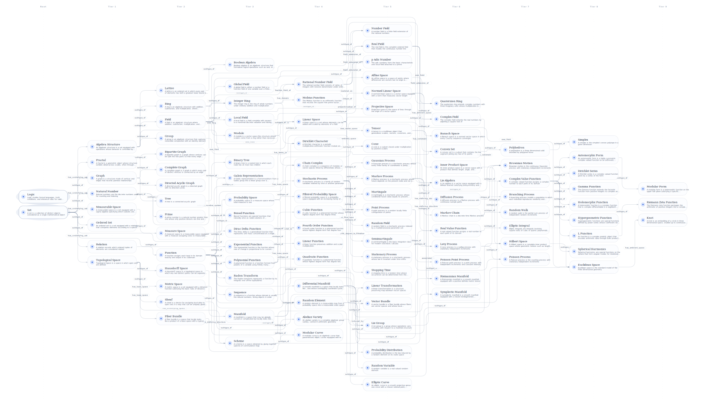

# Math & Physics Notes

[TOC]

## Introduction

This library is a concept-oriented notebook for mathematics, applied mathematics, and physics.

- **Mathematics**: A formal language built from axioms, definitions, structures, and logical consequences.
- **Applied mathematics**: The use and development of mathematical models, methods, and analyses to solve problems arising outside pure mathematics.
- **Physics**: The study of natural phenomena by formulating mathematical models and validating them through observation and experiment.
- **Engineering**: The application of proven knowledge to design, implement, verify, operate, and maintain systems that satisfy requirements under real-world constraints.

### Map

| Path | Role |
| :---: | --- |
| [`math/`](./math/) | Pure mathematical concepts organized as a directed knowledge graph. |
| [`applied mathematics/`](./applied%20mathematics/) | Problem-oriented mathematical tools: algorithms, cryptography, differential equations, geometry, information, language, optimization, and statistics. |
| [`physics/`](./physics/) | Physical theories, core principles, fields, spacetime models, fluids, statistical mechanics, and experiments. |

## Mathematics



The math folder is maintained as a concept graph. Each Markdown file is a node; links in `Include` and `Parents` define directed edges between nodes.

### Note Format

Each mathematical concept should use the following structure:

```markdown
# Concept Name

[TOC]

## Define

The definition of the concept.

## Properties

Important theorems, equivalent characterizations, operations, examples, and counterexamples.

## Include

- [Child_Concept](./Child_Concept.md): edge_label

## Parents

- [Parent_Concept](./Parent_Concept.md): edge_label
```

### Graph Rules

- A note should focus on one mathematical entity.
- `Define` should contain the minimal definition and the notation needed to identify the entity.
- `Properties` should hold the working knowledge: identities, closure properties, constructions, canonical examples, and important theorems.
- `Include` lists lower-level or contained concepts.
- `Parents` lists higher-level or prerequisite concepts.
- Together, the notes are intended to form a directed acyclic graph.

### Graph Maintenance Layout

[`math/skills/`](.agents/skills/) stores the repository rules used to maintain the math graph as an object-centered, sparse, and consistent ontology.

| Path | Role |
| --- | --- |
| [`math/skills/classify-math-concept-node/`](.agents/skills/classify-math-concept-node/) | Node-boundary policy: decide whether a concept becomes a standalone node, is merged upward, or is stored as non-object information. |
| [`math/skills/classify-math-concept-node/references/`](.agents/skills/classify-math-concept-node/references/) | Node examples, ontology rules, and borderline cases. |
| [`math/skills/classify-math-object-edges/`](.agents/skills/classify-math-object-edges/) | Edge-retention policy: decide whether an edge between approved object nodes should be kept and how it should be typed. |
| [`math/skills/classify-math-object-edges/references/`](.agents/skills/classify-math-object-edges/references/) | Canonical edge judgments and excluded edge categories. |

Apply the policies in this order:

1. Decide node boundaries first.
2. Keep only approved object nodes.
3. Classify edges only between retained nodes.

### Node Decision Policy

Use [`math/skills/classify-math-concept-node/SKILL.md`](.agents/skills/classify-math-concept-node/SKILL.md) when deciding whether a term such as `group`, `compactness`, `dual space`, or `Banach space` should become its own note.

- Default policy is `STRICT`.
- Create a node only when the concept is a core mathematical object class, or a specialized object class that is mathematically classical, frequently used, or a stable subject of discourse.
- Merge structures into their parent object node.
- Merge standard constructions into their source object node.
- Store properties, relations, theorems, methods, procedures, representations, and invariants inside object nodes instead of creating standalone nodes for them.
- When the boundary between specialized object, structure on an object, and construction remains unclear, prefer the smaller ontology or request human judgment.

The node classifier returns a normalized record with:

- `decision`: create node, merge into a target object, or store as non-object information.
- `classification`: core object, specialized object class, structure on object, construction, property, relation, theorem, method, procedure, invariant, representation, or related category.
- `merge_target`, `storage_location`, and `confidence`.

### Edge Decision Policy

Use [`math/skills/classify-math-object-edges/SKILL.md`](.agents/skills/classify-math-object-edges/SKILL.md) after node policy has already approved both endpoints as retained object nodes.

- Default policy mode is `STRICT_DEFAULT`.
- The default retained edge set is `is_a` and `defined_over`.
- `modeled_on` is optional and should be enabled only for geometric objects whose identity depends on a standard local model.
- `requires_object` is disabled by default and should be used only in explicitly expanded policies.
- Add an edge only if it is object-level, semantically necessary, direct, non-redundant, and improves the global skeleton of the graph.
- Reject theorem dependencies, proof methods, historical influence, pedagogical ordering, analogies, and other non-structural relations from the main DAG.
- Prefer the nearest valid parent for `is_a`, and reject transitive shortcuts by default.

The edge classifier returns a structured judgment with:

- `decision`: add or reject the edge.
- `edge_type`: one of `is_a`, `defined_over`, `modeled_on`, `requires_object`, or `null`.
- `redundancy_check`: whether the edge violates nearest-parent, transitive, or low-value-edge rules.
- `reasoning`, `notes`, and `confidence`.

## Graph Synchronization

The graph tools live in [`math/src/`](./math/src/). Start the local Flask service first:

```powershell
cd D:/Algo/Notes/math_physics/math/src
python service.py
```

### Markdown To Graph JSON

Build a graph JSON snapshot from the Markdown notes:

```bash
curl --location 'http://localhost:5000/function' \
--header 'Content-Type: application/json' \
--data '{
  "function": "build_graph_json_from_markdown_folder",
  "params": {
    "folder_path": "D:/Algo/Notes/math_physics/math/"
  }
}'
```

### Graph JSON To Markdown

Regenerate Markdown notes from the graph JSON:

```bash
curl --location 'http://localhost:5000/function' \
--header 'Content-Type: application/json' \
--data '{
  "function": "build_markdown_from_graph_json",
  "params": {
    "json_file": "D:/Algo/Notes/math_physics/math/lib/math.json"
  }
}'
```

## Applied Mathematics

Applied mathematics is organized by problem type:

- [`algorithm/`](./applied%20mathematics/algorithm/) records data structures, graph problems, sequence problems, sorting, hashing, trees, heaps, and related algorithmic patterns.
- [`cryptography/`](./applied%20mathematics/cryptography/) records symmetric encryption, asymmetric encryption, hash algorithms, RSA, ECC, DES, AES, MD5, and SHA.
- [`differential equation/`](./applied%20mathematics/differential%20equation/) records ODEs, PDEs, and second-order linear PDEs.
- [`geometric construction/`](./applied%20mathematics/geometric%20construction/) records Bezier curves, triangulation, convex hulls, sampling, deformation, contour surfaces, and noise generation.
- [`geometric problem/`](./applied%20mathematics/geometric%20problem/) records intersection problems in flat and curved spaces.
- [`information/`](./applied%20mathematics/information/) records communication, compressed sensing, error correction, and measurement of information.
- [`language/`](./applied%20mathematics/language/) records formal language and abstract syntax trees.
- [`optimization problem/`](./applied%20mathematics/optimization%20problem/) records linear programming, integer programming, convex optimization, descent methods, ADMM, proximal gradient, interior point methods, and knapsack problems.
- [`statistics/`](./applied%20mathematics/statistics/) records regression, classification, interpolation, Gaussian processes, time series, unit-root tests, hypothesis testing, and stochastic differential equations.

## Physics

Physics notes are organized around action, symmetry, spacetime, fields, and complex systems.

### Mechanics

The basic principle is stationary action:

$$
\delta S = 0
$$

with

$$
S = \int L(q, \dot q, t)\,\mathrm dt.
$$

The Euler-Lagrange equation follows from this principle:

$$
\frac{\mathrm d}{\mathrm dt}\left(\frac{\partial L}{\partial \dot q}\right) - \frac{\partial L}{\partial q} = 0.
$$

Symmetry gives conservation laws through Noether's theorem:

- time translation symmetry gives conservation of energy;
- spatial translation symmetry gives conservation of momentum;
- rotational symmetry gives conservation of angular momentum.

### Spacetime

- **Absolute spacetime**: classical particle mechanics.

  $$
  S = \int \left(\frac{m v^2}{2} - U(\boldsymbol r, t)\right)\mathrm dt
  $$

- **Flat spacetime**: special-relativistic mechanics and field theory.
- **Curved spacetime**: general relativity and gravitational dynamics.

  $$
  S = -\frac{1}{c}\int L_m\sqrt{-g}\,\mathrm d^4x
  + \frac{c^3}{16\pi G}\int R\sqrt{-g}\,\mathrm d^4x
  $$

### Fields

- **Electromagnetic field**

  $$
  S = \sum\int mc\,\mathrm ds
  - \sum \int \frac{e}{c} A_k\,\mathrm dx^k
  - \frac{1}{16 \pi c}\int F_{ik}F^{ik}\,\mathrm d\Omega
  $$

- **Quantum field**: fields become the fundamental degrees of freedom.
- **Quantum mechanics**: states live in Hilbert space, observables are operators, and probabilities follow from amplitudes.
- **Gravitational field**: spacetime geometry becomes dynamical.

### Complex Systems

- **Fluid**

  $$
  \rho \left(\frac{\partial\boldsymbol v}{\partial t}
  + (\boldsymbol v \cdot \nabla)\boldsymbol v \right)
  =
  - \nabla P
  + \rho \boldsymbol f
  + \eta \nabla^2 \boldsymbol v
  + \left(\zeta + \frac{\eta}{3}\right)\nabla(\nabla \cdot \boldsymbol v)
  $$

- **Statistics**: macroscopic behavior from microscopic states and probability distributions.

## Maintenance Principles

- Keep each note centered on one concept.
- Prefer structural links over loose references.
- Put definitions before examples and formulas before interpretation when that improves precision.
- Move mature drafts out of [`tmp/`](./tmp/) into the appropriate folder.
- When changing graph structure, keep Markdown files and `math/lib/math.json` synchronized.
