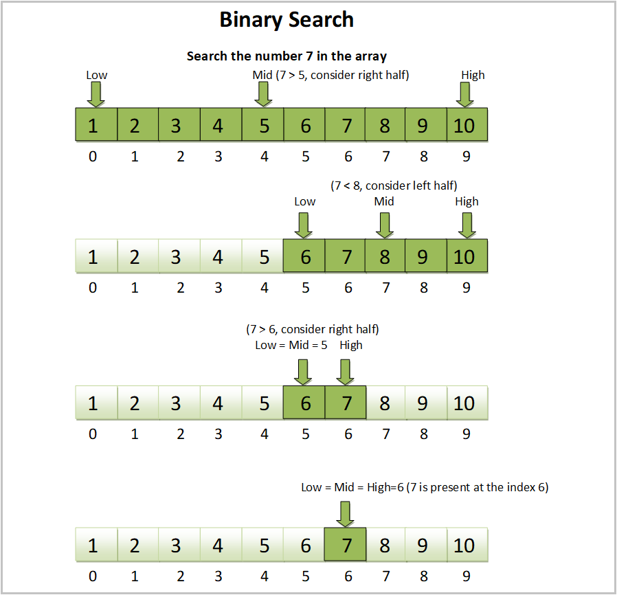

# Problems of Sequence

[TOC]

## Search elements

### Binary Search

For a sorted array, we aim to find a target value $v$ in the array $a$.




#### Property  
we assume an ascending array $a = \{a_1, ..., a_n\}$, $a_i \le a_j , i \le j$, then,
$$
a_i < v \quad\Rightarrow\quad a_j < v, \forall a_j \in \{a_1, ..., a_i\}
$$
$$
a_i > v \quad\Rightarrow\quad a_j > v, \forall a_j \in \{a_i, ..., a_n\}
$$

#### Process  
We divide the search interval in half, $\text{mid} = \frac{\text{start} + \text{end}}{2}$, and determine whether the middle value $a_{\text{mid}}$ meets the target at each iteration $(t)$. 
$$
a^{(t)} = \{a_{\text{start}},..., a_{\text{end}}\} \to \{a_{\text{start}},..., a_{\text{mid}-1}\} \cup \{a_{\text{mid}}\} \cup \{a_{\text{mid}+1},..., a_{\text{end}}\}
$$

- If satisfied, $a_{\text{mid}}$ is the answer. 
- If not satisfied, just select the half interval that may meet the target value for the next interation.

$$
\begin{align*}
    a_{\text{mid}} = v &\quad\Rightarrow\quad \{a_{\text{mid}}\}  \\
    a_{\text{mid}} > v &\quad\Rightarrow\quad a^{(t+1)} = \{a_{\text{start}},..., a_{\text{mid}-1}\}  \\
    a_{\text{mid}} < v &\quad\Rightarrow\quad a^{(t+1)} = \{a_{\text{mid}+1},..., a_{\text{end}}\}
\end{align*}
$$

We repeat the above operation until the search interval can't be divided and return that there is no target value in the array $a$.

$$\text{start} > (\text{mid}-1) \text{ or } (\text{mid} + 1) > \text{end} \quad\Rightarrow\quad a^{(t+1)} \text{ is invalid}$$

### Search the $k$-th largest element

## Sort sequence

对于元素间定义了次序的列表,  列表排序是指将列表中的所有元素, 按照彼此之间的大小次序重新定义 $\mathbb Z \to S$ 的关系, 保证 $f(a) \le f(b), \forall a \le b$.

### Quick Sort

Quick sort is a divide-and-conquer sorting algorithm. Based on the first value $a_1$, we divide the array into two sub-arrays according to whether they are greater than $a_1$ or less than $a_1$. We repeat the above operation for two sub-arrays just like the binary tree until the array cannot be divided.


$$
\begin{align*}
\left\{a_{s:k-1}^{t+1}, \left(a_{k}^{t+1} \right), a_{k+1:e}^{t+1} \right\} &= \text{partition}\left(a_{s:e}^{t} \right)  \\
a_{k}^{t+1} &= a_{s}^{t}  \\
a_{s:k-1}^{t+1} &\prec a_{s}^{t}  \\
a_{k+1:e}^{t+1} &\succeq a_{s}^{t}
\end{align*}
$$

- $a^t_{s:t}$: the subsequence from $s$ to $e$ of the sequence. $t$ is the iteration number of the sequence.


```C
QuickSort(int[] a, int l, int r) {
    if (l >= r) 
      return;

    int p = Partition(a, l, r);
    QuickSort(a, l, p - 1);
    QuickSort(a, p + 1, r);
}
```

  Where partition can be implemented like,
  ```c
  void Partition(int[] a, int l, int r) {
      int i = l - 1;
  
      for (int j = l ; j > r; j++) 
          if(a[j] <= a[i]) {
              i++;
              swap(a[i], a[j]);
          }
  
      i++;
      swap(a[i], a[j]);
  
      return i;
  }
  ```

#### Property

- **Time complexity**: average time complexity $O(n \log n)$, worst-case time complexity $O(n^2)$

### Merge Sort

Merge Sort is a divide-and-conquer sorting algorithm. It works by dividing the input data into smaller, manageable parts (divide) and then merging these parts in a sorted order (conquer).

$$
b^{(l, l)} \gets a^{(l, l)}
$$

$$
b^{(l, r)} \gets \text{merge} (b^{(l, m)}, b^{(m+1, r)})
$$

  ```c
  void mergeSort(int[] a, int l, int r) { 
    if (l >= r) 
      return;
      
    int m = l + (r - l) / 2; 
    mergeSort(a, l, m); 
    mergeSort(a, m + 1, r); 
    merge(a, l, m, r); 
  } 
  ```

Due to the the smaller parts have been sorted, the merging process is done by comparing the first element of each of the smaller parts and merging them back into one sorted array, until all the elements are in the correct order.

- Property
  - Time complexity: $O(n \log n)$

### Heap Sort

In heap sort, the array is first turned into a binary heap, and the root node, which is either the maximum or minimum element, is swapped with the last element of the array. The heap is then rebuilt without the last element, and the process repeats until the heap is empty. By swapping the root node with the last element, we ensure that the largest or smallest element moves to the end of the array, and the array is partially sorted.

  ```c
  void heapSort(int[] a, int n) {
      for (int i = n / 2 - 1; i >= 0; i--)
          heapify(a, n, i);
  
      for (int i=n-1; i>=0; i--) {
          swap(a[0], a[i]);
          heapify(a, i, 0);
      }
  }
  ```

- Property
  - Time complexity: $O(n \log n)$

### Insertion Sort

we start from the left side of the array, and compare each element with the element next to it. If the element on the right is smaller than the element on the left, the two elements are swapped. This process continues until the end of the list is reached.

  ```c
  void insertionSort(int[] a, int n) {
      for (int i = 1; i < n; i++) {
          int key = a[i],
              j = i-1;
    
          while (j >= 0 && a[j] > key) {
              a[j+1] = a[j];
              j = j - 1;
          }
          a[j+1] = key;
      }
  }
  ```

- Property
  - Time complexity: $O(n^2)$

### Selection Sort

We repeatedly select and cut the mininum element from the original array $a$ into the sorted array $b$.

$$b^{(0)} = \emptyset$$ 
$$b^{(t)} = \left\{b^{(t-1)}, \min \left(a - b^{(t-1)} \right)\right\}$$ 

- Property
  - Time complexity: $O(n^2)$

### Bubble Sort
Bubble sort works by repeatedly swapping adjacent elements if they are in the wrong order until the list is sorted.

```c
void bubbleSort(int[] a, int n) {
for (int i = 0; i < n-1; i++)
    for (int j = 0; j < n-i-1; j++)
        if (a[j] > a[j+1]) 
            swap(a[j], a[j+1]);
}
```

- Property
  - Time complexity: $O(n^2)$

## Subsequence Problem


### Longest Common Subsequence

#### Purpose  

For a given sequence $a, b$, 
$$
\begin{align*}
  \arg\max_{x}  \quad & \text{number}(x)  \\
  s.t. \quad & x \subseteq a  \\
    & x \subseteq b
\end{align*}
$$

#### Algorithm

Dynamic Programming  
$$
\begin{align*}
  f(a_{1:n}, b_{1:m}) &= \left\{\begin{matrix}
    f(a_{1:n-1}, b_{1:m-1}) + 1 \quad &;  a_n = b_m  \\
    \max(f(a_{1:n}, b_{1:m-1}), f(a_{1:n-1}, b_{1:m})) \quad &;  a_n ≠ b_m  \\
  \end{matrix}\right.  \\

  f(a_1, b_1) &= \left\{\begin{matrix}
    1    \quad ; a_1 = b_1  \\
    0   \quad ; a_1 ≠ b_1  \\
  \end{matrix}\right.  \tag{initial}
\end{align*}
$$

#### Include

* Longest Continuous Common Subsequence
  - Algorithm  
    Dynamic Programming  
    $$
    \begin{align*}
      f(a_{1:n}, b_{1:m}) &= \left\{\begin{matrix}
        f(a_{1:n-1}, b_{1:m-1}) + 1 \quad &;  a_n = b_m  \\
        0  \quad &;  a_n ≠ b_m
      \end{matrix}\right.  \\
    
      f(a_i, b_1) &= \left\{\begin{matrix}
        1  \quad ; a_i = b_1  \\
        0  \quad ; a_i ≠ b_1
      \end{matrix}\right.  \tag{initial}  \\
    
      f(a_1, b_i) &= \left\{\begin{matrix}
        1  \quad ; a_1 = b_i  \\
        0  \quad ; a_1 ≠ b_i
      \end{matrix}\right.
    \end{align*}
    $$

### Longest Ascending Subsequence

#### Purpose  

For a given sequence $a$
$$
\begin{align*}
  \max_{x \subseteq a}  \quad & \text{number}(x)  \\
  s.t. \quad & x_i < x_{i+1} \quad ; i \in 1:\text{number}(x)
\end{align*}
$$

#### Algorithm  

$$
\begin{align*}
  f(n) = \max(f(i), \max(f(j)) + 1) \quad ; j < i \ \text{and}\ a_j < a_i  \\
  f(1) = 1  \tag{initial}
\end{align*}
$$
$f(n)$: 以$a_n$为结尾的最长上升子序列的长度.


### Longest Prefix-Suffix

#### Purpose  

For a given sequence $a$, we aim to find the maximum length $k^*$ of the prefix and suffix of itself, where the prefix equals suffix.
$$
\begin{align*}
  \max \quad & k  \\
  s.t. \quad & a_{1:k} = a_{n-k+1:n}  \tag{prefix = suffix}
\end{align*}
$$

#### Algorithm  

For each place $n$ and the successive subsequence $a_{1:n}$ of $a$, we iterative search as follows until the condition is met 
$$
\begin{align*}
  f(n) = k_n^* = \left\{\begin{matrix}
    f(n-1) + 1  \quad &;  a_n = a_{f(n-1) + 1}  \\
    f(f(n-1)) + 1 \quad &; a_n = a_{f(f(n-1)) + 1}  \\
    \vdots & \vdots  \\
    0  \quad &; other
  \end{matrix}\right.
\end{align*}
$$

$f(n)$ means maximum prefix-suffix length $k_n^*$ for the successive subsequence $a_{1:n}$ of $a$.

