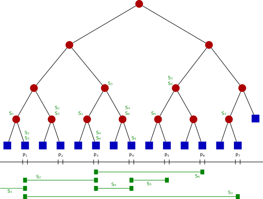

# Segment Tree

[TOC]

## Problem

A segment tree is designed to solve the problem of **efficient range queries and range updates on an array**.

- What is the sum, minimum, maximum, or greatest common divisor of a subarray?
- How can I update one element and keep future range queries fast?
- How can I update a whole range without touching every element one by one?

## Core Idea

A segment tree divides an array into nested intervals.

Each node represents an interval:
$$
[l, r]
$$

The root represents the whole array. Each internal node splits its interval into two smaller intervals:
$$
[l, mid], [mid + 1, r]
$$

Each leaf represents one array element.

The practical essence of a segment tree is:

1. **Store aggregate information for intervals**
2. **Split queries into a small number of disjoint covered intervals**
3. **Update only the nodes affected by the changed range**

Because the tree height is logarithmic, queries and updates usually cost:
$$
O(\log n)
$$

## Solution

### Tree Meaning

For an array:
$$
A = [a_1, a_2, ..., a_n]
$$

a segment tree stores information about many intervals of $A$.

For example, if the operation is range sum, each node stores:
$$
tree[v] = \sum_{i=l}^{r} A_i
$$

If the operation is range minimum, each node stores:
$$
tree[v] = \min(A_l, A_{l+1}, ..., A_r)
$$

The stored value depends on the query type.

### Merge Function

Each internal node is computed from its two children.

For range sum:
$$
tree[v] = tree[2v] + tree[2v + 1]
$$

For range minimum:
$$
tree[v] = \min(tree[2v], tree[2v + 1])
$$

The merge function must match the query being answered.

Common merge operations include:

- sum
- minimum
- maximum
- greatest common divisor
- bitwise and / or

### Build

To build the tree:

1. Recursively split the current interval.
2. Store array values at leaf nodes.
3. Merge child values back upward.

Building touches every node, so the cost is:
$$
O(n)
$$

### Range Query

To answer a query on interval $[q_l, q_r]$, compare the query interval with the current node interval $[l, r]$.

There are three cases:

- **No overlap**: ignore this node.
- **Full cover**: return this node's stored value.
- **Partial overlap**: query both children and merge their answers.

Only $O(\log n)$ relevant boundary paths are explored, so a normal range query costs:
$$
O(\log n)
$$

### Point Update

To update one element:

1. Descend from the root to the corresponding leaf.
2. Modify the leaf value.
3. Recompute all affected ancestors.

Since only one root-to-leaf path is affected, the cost is:
$$
O(\log n)
$$

### Range Update And Lazy Propagation

If every element in a range is updated directly, the operation may cost $O(n)$.

**Lazy propagation** avoids this by storing delayed update information on fully covered nodes.

For a range update:

1. If the current interval is fully covered, update the node and store a lazy tag.
2. If the current interval is partially covered, push pending tags to children.
3. Recurse into the necessary children.
4. Merge child values back into the current node.

Lazy propagation is commonly used for operations like:

- add a value to every element in a range
- assign every element in a range to the same value
- flip bits in a range

With lazy propagation, range update and range query often cost:
$$
O(\log n)
$$

### Array Storage

A segment tree is usually stored in an array instead of explicit nodes.

For node index $v$:

- left child: $2v$
- right child: $2v + 1$

The array is commonly allocated with size:
$$
4n
$$

This avoids worrying about the exact shape when $n$ is not a power of two.

##  Boundaries

### Operation Must Be Mergeable

A segment tree works best when an interval answer can be built by merging answers from subintervals.

The operation should usually be associative:
$$
merge(merge(a, b), c) = merge(a, merge(b, c))
$$

Without this property, splitting an interval and merging partial answers may not be valid.

### More Complex Than Prefix Sums

If the array is static and only range sum queries are needed, prefix sums are simpler:

- build: **O(n)**
- query: **O(1)**
- update: not efficient

A segment tree is useful when updates and queries are both needed.

### More General Than Fenwick Tree

A Fenwick tree is usually simpler and uses less memory for prefix-like operations such as sums.

A segment tree is more flexible for:

- range minimum / maximum
- custom merge functions
- range updates with lazy propagation
- queries that are not naturally prefix-based

### Lazy Propagation Is Error-Prone

Range updates require correct lazy tag composition and correct push-down logic.

Common mistakes include:

- forgetting to push tags before visiting children
- composing assignment and addition tags in the wrong order
- failing to update node values when storing a lazy tag

### Higher Constant Factor

Although the asymptotic cost is efficient, a segment tree has a larger constant factor than simple arrays or prefix sums because it uses recursion or iterative tree logic and extra storage.

## Cost

The main cost of a segment tree lies in the trade-off between **fast dynamic range operations** and **implementation complexity**.

### Time Cost

- Build: **O(n)**
- Range query: **O(log n)**
- Point update: **O(log n)**
- Range update with lazy propagation: **O(log n)**
- Query the whole array from the root: **O(1)**

### Space Cost

A segment tree requires:
$$
O(n)
$$

In array implementations, it is common to allocate about $4n$ slots.

If lazy propagation is used, an additional lazy array is usually needed:
$$
O(n)
$$

### Engineering Cost

In real systems, implementing a segment tree requires careful decisions about:

- merge function and identity value
- inclusive or half-open interval convention
- recursive versus iterative implementation
- lazy tag meaning and composition
- memory allocation size
- index base, such as zero-indexed or one-indexed arrays

So while the idea is systematic, correctness depends heavily on consistent interval and tag semantics.
