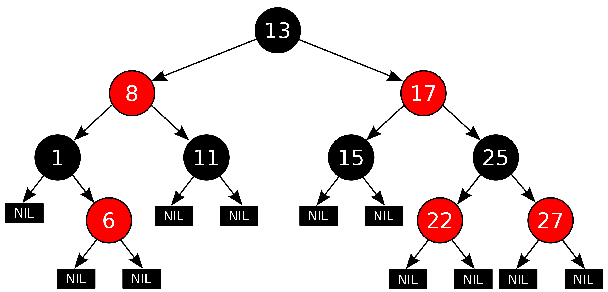

# Self-balancing Search Tree

[TOC]

## Define

A kind of [tree](../../math/tree.md) with self-balancing.

## AVL Tree

An AVL Tree is balanced based on the height difference between the left and right subtrees, which can differ by at most 1.

In an AVL Tree, rotations are performed to balance the tree whenever the height difference exceeds 1. 

## Red-Black Tree

A Red-Black Tree is a type of self-balancing binary search tree.

1. Every node is either red or black.
2. The root is black.
3. Every leaf (NIL) is black.
4. If a node is red, then both its children are black.
5. For each node, all simple paths from the node to leaves contain the same number of black nodes.

### Property

- insert a node

- delete a node  
- rotate left & rotate right

## B Tree

### B+ Tree
