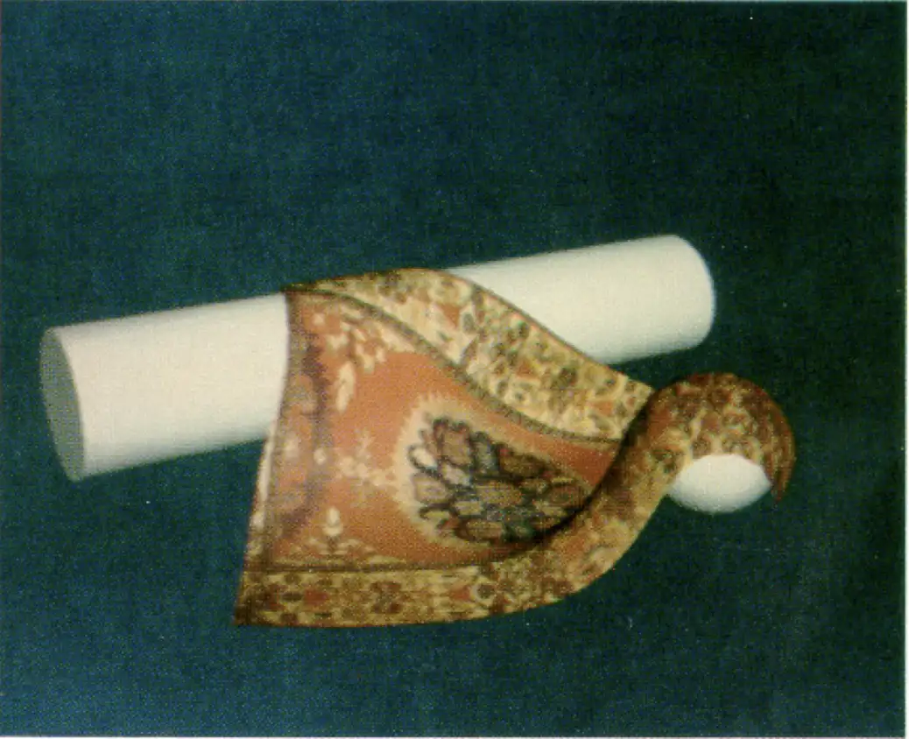

# Elastically Deformable Models

[TOC]

## Problem

Elastically deformable models are designed to solve the problem of **changing shape under forces while resisting distortion**.

- How does a geometric object bend, stretch, or compress under external forces?
- How can deformation preserve physical plausibility?
- How can shape editing, animation, or simulation account for material stiffness?

## Core Idea

An elastic model treats geometry as a material body with internal energy.

The object deforms when external forces do work, but internal elastic forces try to restore the object to a low-energy state.

The practical essence of elastic deformation is:

1. **Represent shape with degrees of freedom**
2. **Define an elastic energy or force law**
3. **Solve for the configuration that balances internal and external forces**

At equilibrium:
$$
f_{internal}(x) + f_{external}(x) = 0
$$

or equivalently:
$$
x^* = \arg\min_x E(x)
$$

where $E(x)$ is the total deformation energy.

## Solution

### Degrees Of Freedom

The object may be represented by:

- mesh vertices
- particles
- control handles
- finite element nodes
- skeleton joints

The unknown vector is usually a stack of positions:
$$
x = (x_1, x_2, ..., x_n)
$$

### Mass-Spring Model

A mass-spring model connects points with springs.

For a spring between points $i$ and $j$:
$$
E_{ij} = \frac{1}{2}k_{ij}(\|x_i-x_j\| - L_{ij})^2
$$

- $k_{ij}$ is stiffness
- $L_{ij}$ is rest length
- $x_i, x_j$ are current positions

This model is simple and useful for cloth, soft bodies, and interactive deformation.

### Continuum Elasticity

Continuum elasticity models a body as a continuous material.

A deformation map sends rest coordinates $X$ to current coordinates $x$:
$$
x = \phi(X)
$$

The deformation gradient is:
$$
F = \frac{\partial \phi}{\partial X}
$$

Elastic energy is defined from strain, such as linear strain or nonlinear strain. Finite element methods discretize this energy over elements.

### Shape Editing Energy

For geometric editing, elastic behavior is often approximated with energies such as:

- Laplacian smoothing energy
- as-rigid-as-possible energy
- thin-plate bending energy
- membrane stretching energy

These methods trade physical exactness for interactive control.

### Simulation Pipeline

A typical elastic simulation pipeline is:

1. Build a mesh or particle structure.
2. Define material parameters and constraints.
3. Compute internal forces or energy gradients.
4. Add external forces such as gravity, contact, or user handles.
5. Integrate motion or solve a static equilibrium problem.
6. Enforce collision and boundary constraints.

##  Boundaries

### Stability Depends On Time Integration

Explicit integration is simple but may require very small time steps for stiff materials.

Implicit integration is more stable but requires solving linear or nonlinear systems.

### Material Model Matters

Different materials need different energy models.

- rubber: large nonlinear deformation
- metal: small elastic deformation before plasticity
- cloth: strong stretching resistance, weak bending resistance
- biological tissue: anisotropic and nonlinear behavior

### Mesh Quality Affects Accuracy

Poor triangles or tetrahedra can cause unstable forces, locking, or visual artifacts.

### Constraints Can Conflict

Fixed points, collision constraints, volume preservation, and user handles may over-constrain the system.

### Physical Accuracy Has A Cost

Mass-spring systems are fast but approximate. Finite element models are more principled but more expensive and harder to implement.

## Cost

The main cost of elastic models lies in the trade-off between **physical realism** and **solver complexity**.

### Time Cost

- Mass-spring force evaluation: **O(m)** for $m$ springs
- Explicit time step: usually **O(m)**
- Implicit time step: depends on the linear or nonlinear solver
- Static energy minimization: iterative, often many sparse solves
- Collision handling: depends on broad-phase and narrow-phase structures

### Space Cost

Elastic models store:

- positions and velocities
- masses and material parameters
- connectivity
- constraints
- sparse matrices for implicit or FEM solvers

The basic storage is typically:
$$
O(n + m)
$$

where $n$ is the number of degrees of freedom and $m$ is the number of connections or elements.

### Engineering Cost

In real systems, implementing elastic deformation requires careful decisions about:

- material law
- mesh or particle discretization
- time integration method
- damping
- collision handling
- constraint enforcement
- sparse solver robustness

So elastic deformation is less about one formula and more about a stable modeling and solver pipeline.
