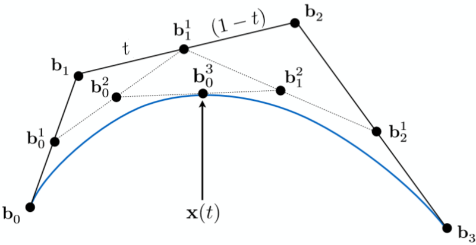

# Bezier Curve

[TOC]

## Problem

A Bezier curve is designed to solve the problem of **constructing a smooth curve from a small number of control points**.

- How can a designer control a curve by moving a few points?
- How can a curve interpolate its endpoints while being guided by intermediate points?
- How can smooth curves be evaluated, subdivided, and rendered efficiently?

## Core Idea

A Bezier curve is a weighted average of control points.

Given control points:
$$
P_0, P_1, ..., P_n
$$

the Bezier curve is:
$$
C(t) = \sum_{i=0}^{n} P_i B_{i,n}(t), \quad t \in [0, 1]
$$

where $B_{i,n}(t)$ is the Bernstein basis function:
$$
B_{i,n}(t) = {n \choose i} t^i(1-t)^{n-i}
$$

The practical essence of a Bezier curve is:

1. **Use control points to define shape**
2. **Use Bernstein weights to blend control points**
3. **Evaluate the curve by interpolation or basis functions**

The curve always lies inside the convex hull of its control points.

## Solution

### Bernstein Form

The Bernstein form evaluates the curve directly:
$$
C(t) = \sum_{i=0}^{n} P_i {n \choose i} t^i(1-t)^{n-i}
$$

Important endpoint properties:
$$
C(0) = P_0
$$

$$
C(1) = P_n
$$

The first and last control edges determine the endpoint tangents:
$$
C'(0) = n(P_1 - P_0)
$$

$$
C'(1) = n(P_n - P_{n-1})
$$

### Quadratic Bezier Curve

For three control points $P_0, P_1, P_2$:
$$
C(t) = (1-t)^2P_0 + 2t(1-t)P_1 + t^2P_2
$$

This is the simplest curved Bezier segment.

### Cubic Bezier Curve

For four control points $P_0, P_1, P_2, P_3$:
$$
C(t) = (1-t)^3P_0 + 3t(1-t)^2P_1 + 3t^2(1-t)P_2 + t^3P_3
$$

Cubic Bezier curves are common in vector graphics, fonts, animation paths, and modeling tools.

### De Casteljau Algorithm

The De Casteljau algorithm evaluates a Bezier curve through repeated linear interpolation.

For adjacent points:
$$
P_i^{(r)}(t) = (1-t)P_i^{(r-1)}(t) + tP_{i+1}^{(r-1)}(t)
$$

with:
$$
P_i^{(0)} = P_i
$$

After $n$ interpolation levels:
$$
C(t) = P_0^{(n)}(t)
$$

The recursive form is:
$$
C_{0,1,...,n}(t) =
(1-t)C_{0,1,...,n-1}(t) + tC_{1,2,...,n}(t)
$$

### Subdivision

De Casteljau evaluation also subdivides a Bezier curve at parameter $t$.

The interpolation triangle produces:

- a left Bezier curve from the left boundary of the triangle
- a right Bezier curve from the right boundary of the triangle

This is useful for adaptive rendering, collision tests, and curve refinement.

### Piecewise Bezier Curves

A single high-degree Bezier curve can be numerically unstable and hard to control. In practice, long curves are usually built from multiple low-degree segments.

To connect two cubic segments smoothly:

- $C^0$ continuity: endpoints match.
- $C^1$ continuity: endpoint tangent vectors match.
- $G^1$ continuity: endpoint tangent directions match.

##  Boundaries

### Global Control

Moving one control point can affect the entire curve. This is convenient for broad shape design, but poor for local editing.

B-splines and NURBS are often preferred when local control is important.

### High Degree Is Expensive

High-degree Bezier curves can be difficult to evaluate and may oscillate. Piecewise cubic curves are usually more stable.

### No Exact General Offset

The offset of a Bezier curve is usually not another Bezier curve of the same degree. Offset curves often require approximation.

### Parameter Is Not Arc Length

Uniform values of $t$ do not usually produce uniformly spaced points along the curve.

If equal arc-length spacing is needed, the curve must be reparameterized or sampled adaptively.

## Cost

The main cost of a Bezier curve lies in the trade-off between **simple control-point modeling** and **limited local control**.

### Time Cost

- Direct Bernstein evaluation of degree $n$: **O(n)**
- De Casteljau evaluation of degree $n$: **O(n^2)**
- Subdivision at one parameter: **O(n^2)**
- Sampling $m$ points directly: **O(mn)** or **O(mn^2)** depending on evaluation method

### Space Cost

A degree-$n$ Bezier curve stores:
$$
O(n)
$$

control points.

### Engineering Cost

In real systems, implementing Bezier curves requires careful decisions about:

- numeric stability
- adaptive sampling tolerance
- continuity between segments
- arc-length parameterization
- conversion to and from spline or polyline representations

So while the formula is compact, robust curve modeling usually depends on sampling, subdivision, and continuity management.
