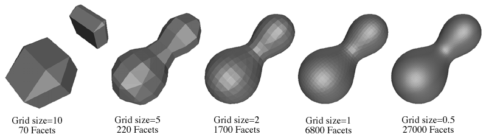
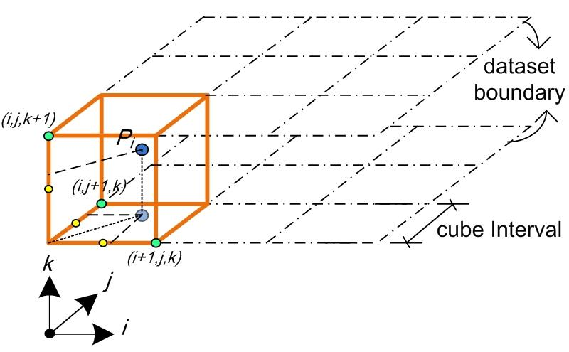
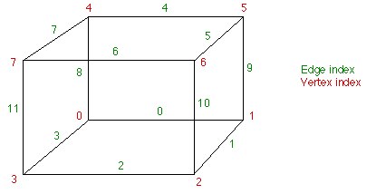
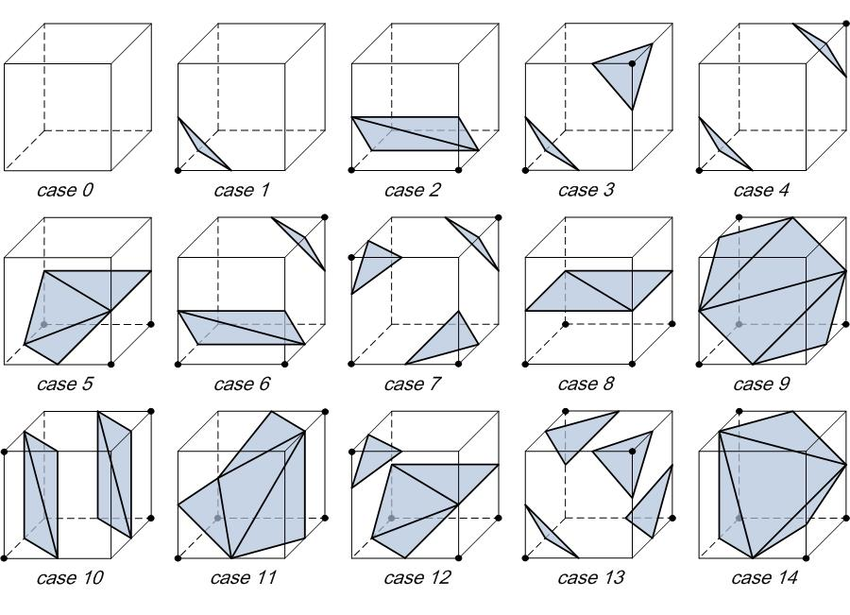

# Contour Surface

[TOC]

## Problem

Contour surface extraction is designed to solve the problem of **constructing a surface from a scalar field**.

- Given a scalar field, where does it reach a selected value?
- How can a volumetric field be converted into a triangle mesh?
- How can implicit geometry be rendered, simulated, or exported as polygons?

For a scalar field:
$$
f : \mathbb{R}^3 \to \mathbb{R}
$$

the iso-surface at value $a$ is:
$$
S_a = \{(x,y,z) \mid f(x,y,z) = a\}
$$

## Core Idea

Marching Cubes approximates an iso-surface by processing one grid cell at a time. Each cube cell samples the scalar field at its eight vertices. The sign pattern of those vertices determines how the iso-surface intersects the cube. The practical essence of Marching Cubes is:

1. **Classify cube vertices against the iso-value**
2. **Find intersected cube edges**
3. **Interpolate surface vertices on those edges**
4. **Use a lookup table to emit triangles**



## Solution

### Grid Sampling

The scalar field is sampled on a regular 3D grid.

For each grid cell, consider its eight corners:
$$
v_0, v_1, ..., v_7
$$

Each corner receives a binary state:
$$
b_i =
\begin{cases}
1, & f(v_i) < a \\
0, & f(v_i) \ge a
\end{cases}
$$

The eight bits form a cube index:
$$
case = \sum_{i=0}^{7} b_i2^i
$$

There are:
$$
2^8 = 256
$$

possible cases.

### Cube Vertex And Edge Convention

A common cube vertex convention is:

| Vertex | Coordinate offset |
| :---: | :---: |
| 0 | $(0,0,0)$ |
| 1 | $(1,0,0)$ |
| 2 | $(1,1,0)$ |
| 3 | $(0,1,0)$ |
| 4 | $(0,0,1)$ |
| 5 | $(1,0,1)$ |
| 6 | $(1,1,1)$ |
| 7 | $(0,1,1)$ |

A common cube edge convention is:

| Edge | Connected vertices |
| :---: | :---: |
| 0 | $(0,1)$ |
| 1 | $(1,2)$ |
| 2 | $(2,3)$ |
| 3 | $(0,3)$ |
| 4 | $(4,5)$ |
| 5 | $(5,6)$ |
| 6 | $(6,7)$ |
| 7 | $(4,7)$ |
| 8 | $(0,4)$ |
| 9 | $(1,5)$ |
| 10 | $(2,6)$ |
| 11 | $(3,7)$ |




### Edge Interpolation

If the iso-surface crosses an edge between points $P_1$ and $P_2$, the intersection point is approximated by linear interpolation:
$$
P = P_1 + \frac{a - f(P_1)}{f(P_2)-f(P_1)}(P_2-P_1)
$$

This gives a more accurate surface than simply using the edge midpoint.

### Triangle Lookup Table

The cube index selects a row in a precomputed triangle table.

Each row stores groups of three edge indices:
$$
(e_1,e_2,e_3)
$$

Each group becomes one triangle whose vertices are the interpolated points on those edges.

The full table has 256 cases, but many are symmetric under rotation and complement.



| Case     | Triangular Facets                                          |      | Case     | Triangular Facets                                          |
| -------- | ---------------------------------------------------------- | ---- | -------- | ---------------------------------------------------------- |
| 00000000 | ()                                                         |      | 00000001 | (0, 8, 3)                                                  |
| 00000010 | (0, 1, 9)                                                  |      | 00000011 | (1, 8, 3)  (9, 8, 1)                                       |
| 00000100 | (1, 2, 10)                                                 |      | 00000101 | (0, 8, 3)  (1, 2, 10)                                      |
| 00000110 | (9, 2, 10)  (0, 2, 9)                                      |      | 00000111 | (2, 8, 3)  (2, 10, 8)  (10, 9, 8)                          |
| 00001000 | (3, 11, 2)                                                 |      | 00001001 | (0, 11, 2)  (8, 11, 0)                                     |
| 00001010 | (1, 9, 0)  (2, 3, 11)                                      |      | 00001011 | (1, 11, 2)  (1, 9, 11)  (9, 8, 11)                         |
| 00001100 | (3, 10, 1)  (11, 10, 3)                                    |      | 00001101 | (0, 10, 1)  (0, 8, 10)  (8, 11, 10)                        |
| 00001110 | (3, 9, 0)  (3, 11, 9)  (11, 10, 9)                         |      | 00001111 | (9, 8, 10)  (10, 8, 11)                                    |
| 00010000 | (4, 7, 8)                                                  |      | 00010001 | (4, 3, 0)  (7, 3, 4)                                       |
| 00010010 | (0, 1, 9)  (8, 4, 7)                                       |      | 00010011 | (4, 1, 9)  (4, 7, 1)  (7, 3, 1)                            |
| 00010100 | (1, 2, 10)  (8, 4, 7)                                      |      | 00010101 | (3, 4, 7)  (3, 0, 4)  (1, 2, 10)                           |
| 00010110 | (9, 2, 10)  (9, 0, 2)  (8, 4, 7)                           |      | 00010111 | (2, 10, 9)  (2, 9, 7)  (2, 7, 3)  (7, 9, 4)                |
| 00011000 | (8, 4, 7)  (3, 11, 2)                                      |      | 00011001 | (11, 4, 7)  (11, 2, 4)  (2, 0, 4)                          |
| 00011010 | (9, 0, 1)  (8, 4, 7)  (2, 3, 11)                           |      | 00011011 | (4, 7, 11)  (9, 4, 11)  (9, 11, 2)  (9, 2, 1)              |
| 00011100 | (3, 10, 1)  (3, 11, 10)  (7, 8, 4)                         |      | 00011101 | (1, 11, 10)  (1, 4, 11)  (1, 0, 4)  (7, 11, 4)             |
| 00011110 | (4, 7, 8)  (9, 0, 11)  (9, 11, 10)  (11, 0, 3)             |      | 00011111 | (4, 7, 11)  (4, 11, 9)  (9, 11, 10)                        |
| 00100000 | (9, 5, 4)                                                  |      | 00100001 | (9, 5, 4)  (0, 8, 3)                                       |
| 00100010 | (0, 5, 4)  (1, 5, 0)                                       |      | 00100011 | (8, 5, 4)  (8, 3, 5)  (3, 1, 5)                            |
| 00100100 | (1, 2, 10)  (9, 5, 4)                                      |      | 00100101 | (3, 0, 8)  (1, 2, 10)  (4, 9, 5)                           |
| 00100110 | (5, 2, 10)  (5, 4, 2)  (4, 0, 2)                           |      | 00100111 | (2, 10, 5)  (3, 2, 5)  (3, 5, 4)  (3, 4, 8)                |
| 00101000 | (9, 5, 4)  (2, 3, 11)                                      |      | 00101001 | (0, 11, 2)  (0, 8, 11)  (4, 9, 5)                          |
| 00101010 | (0, 5, 4)  (0, 1, 5)  (2, 3, 11)                           |      | 00101011 | (2, 1, 5)  (2, 5, 8)  (2, 8, 11)  (4, 8, 5)                |
| 00101100 | (10, 3, 11)  (10, 1, 3)  (9, 5, 4)                         |      | 00101101 | (4, 9, 5)  (0, 8, 1)  (8, 10, 1)  (8, 11, 10)              |
| 00101110 | (5, 4, 0)  (5, 0, 11)  (5, 11, 10)  (11, 0, 3)             |      | 00101111 | (5, 4, 8)  (5, 8, 10)  (10, 8, 11)                         |
| 00110000 | (9, 7, 8)  (5, 7, 9)                                       |      | 00110001 | (9, 3, 0)  (9, 5, 3)  (5, 7, 3)                            |
| 00110010 | (0, 7, 8)  (0, 1, 7)  (1, 5, 7)                            |      | 00110011 | (1, 5, 3)  (3, 5, 7)                                       |
| 00110100 | (9, 7, 8)  (9, 5, 7)  (10, 1, 2)                           |      | 00110101 | (10, 1, 2)  (9, 5, 0)  (5, 3, 0)  (5, 7, 3)                |
| 00110110 | (8, 0, 2)  (8, 2, 5)  (8, 5, 7)  (10, 5, 2)                |      | 00110111 | (2, 10, 5)  (2, 5, 3)  (3, 5, 7)                           |
| 00111000 | (7, 9, 5)  (7, 8, 9)  (3, 11, 2)                           |      | 00111001 | (9, 5, 7)  (9, 7, 2)  (9, 2, 0)  (2, 7, 11)                |
| 00111010 | (2, 3, 11)  (0, 1, 8)  (1, 7, 8)  (1, 5, 7)                |      | 00111011 | (11, 2, 1)  (11, 1, 7)  (7, 1, 5)                          |
| 00111100 | (9, 5, 8)  (8, 5, 7)  (10, 1, 3)  (10, 3, 11)              |      | 00111101 | (5, 7, 0)  (5, 0, 9)  (7, 11, 0)  (1, 0, 10)  (11, 10, 0)  |
| 00111110 | (11, 10, 0)  (11, 0, 3)  (10, 5, 0)  (8, 0, 7)  (5, 7, 0)  |      | 00111111 | (11, 10, 5)  (7, 11, 5)                                    |
| 01000000 | (10, 6, 5)                                                 |      | 01000001 | (0, 8, 3)  (5, 10, 6)                                      |
| 01000010 | (9, 0, 1)  (5, 10, 6)                                      |      | 01000011 | (1, 8, 3)  (1, 9, 8)  (5, 10, 6)                           |
| 01000100 | (1, 6, 5)  (2, 6, 1)                                       |      | 01000101 | (1, 6, 5)  (1, 2, 6)  (3, 0, 8)                            |
| 01000110 | (9, 6, 5)  (9, 0, 6)  (0, 2, 6)                            |      | 01000111 | (5, 9, 8)  (5, 8, 2)  (5, 2, 6)  (3, 2, 8)                 |
| 01001000 | (2, 3, 11)  (10, 6, 5)                                     |      | 01001001 | (11, 0, 8)  (11, 2, 0)  (10, 6, 5)                         |
| 01001010 | (0, 1, 9)  (2, 3, 11)  (5, 10, 6)                          |      | 01001011 | (5, 10, 6)  (1, 9, 2)  (9, 11, 2)  (9, 8, 11)              |
| 01001100 | (6, 3, 11)  (6, 5, 3)  (5, 1, 3)                           |      | 01001101 | (0, 8, 11)  (0, 11, 5)  (0, 5, 1)  (5, 11, 6)              |
| 01001110 | (3, 11, 6)  (0, 3, 6)  (0, 6, 5)  (0, 5, 9)                |      | 01001111 | (6, 5, 9)  (6, 9, 11)  (11, 9, 8)                          |
| 01010000 | (5, 10, 6)  (4, 7, 8)                                      |      | 01010001 | (4, 3, 0)  (4, 7, 3)  (6, 5, 10)                           |
| 01010010 | (1, 9, 0)  (5, 10, 6)  (8, 4, 7)                           |      | 01010011 | (10, 6, 5)  (1, 9, 7)  (1, 7, 3)  (7, 9, 4)                |
| 01010100 | (6, 1, 2)  (6, 5, 1)  (4, 7, 8)                            |      | 01010101 | (1, 2, 5)  (5, 2, 6)  (3, 0, 4)  (3, 4, 7)                 |
| 01010110 | (8, 4, 7)  (9, 0, 5)  (0, 6, 5)  (0, 2, 6)                 |      | 01010111 | (7, 3, 9)  (7, 9, 4)  (3, 2, 9)  (5, 9, 6)  (2, 6, 9)      |
| 01011000 | (3, 11, 2)  (7, 8, 4)  (10, 6, 5)                          |      | 01011001 | (5, 10, 6)  (4, 7, 2)  (4, 2, 0)  (2, 7, 11)               |
| 01011010 | (0, 1, 9)  (4, 7, 8)  (2, 3, 11)  (5, 10, 6)               |      | 01011011 | (9, 2, 1)  (9, 11, 2)  (9, 4, 11)  (7, 11, 4)  (5, 10, 6)  |
| 01011100 | (8, 4, 7)  (3, 11, 5)  (3, 5, 1)  (5, 11, 6)               |      | 01011101 | (5, 1, 11)  (5, 11, 6)  (1, 0, 11)  (7, 11, 4)  (0, 4, 11) |
| 01011110 | (0, 5, 9)  (0, 6, 5)  (0, 3, 6)  (11, 6, 3)  (8, 4, 7)     |      | 01011111 | (6, 5, 9)  (6, 9, 11)  (4, 7, 9)  (7, 11, 9)               |
| 01100000 | (10, 4, 9)  (6, 4, 10)                                     |      | 01100001 | (4, 10, 6)  (4, 9, 10)  (0, 8, 3)                          |
| 01100010 | (10, 0, 1)  (10, 6, 0)  (6, 4, 0)                          |      | 01100011 | (8, 3, 1)  (8, 1, 6)  (8, 6, 4)  (6, 1, 10)                |
| 01100100 | (1, 4, 9)  (1, 2, 4)  (2, 6, 4)                            |      | 01100101 | (3, 0, 8)  (1, 2, 9)  (2, 4, 9)  (2, 6, 4)                 |
| 01100110 | (0, 2, 4)  (4, 2, 6)                                       |      | 01100111 | (8, 3, 2)  (8, 2, 4)  (4, 2, 6)                            |
| 01101000 | (10, 4, 9)  (10, 6, 4)  (11, 2, 3)                         |      | 01101001 | (0, 8, 2)  (2, 8, 11)  (4, 9, 10)  (4, 10, 6)              |
| 01101010 | (3, 11, 2)  (0, 1, 6)  (0, 6, 4)  (6, 1, 10)               |      | 01101011 | (6, 4, 1)  (6, 1, 10)  (4, 8, 1)  (2, 1, 11)  (8, 11, 1)   |
| 01101100 | (9, 6, 4)  (9, 3, 6)  (9, 1, 3)  (11, 6, 3)                |      | 01101101 | (8, 11, 1)  (8, 1, 0)  (11, 6, 1)  (9, 1, 4)  (6, 4, 1)    |
| 01101110 | (3, 11, 6)  (3, 6, 0)  (0, 6, 4)                           |      | 01101111 | (6, 4, 8)  (11, 6, 8)                                      |
| 01110000 | (7, 10, 6)  (7, 8, 10)  (8, 9, 10)                         |      | 01110001 | (0, 7, 3)  (0, 10, 7)  (0, 9, 10)  (6, 7, 10)              |
| 01110010 | (10, 6, 7)  (1, 10, 7)  (1, 7, 8)  (1, 8, 0)               |      | 01110011 | (10, 6, 7)  (10, 7, 1)  (1, 7, 3)                          |
| 01110100 | (1, 2, 6)  (1, 6, 8)  (1, 8, 9)  (8, 6, 7)                 |      | 01110101 | (2, 6, 9)  (2, 9, 1)  (6, 7, 9)  (0, 9, 3)  (7, 3, 9)      |
| 01110110 | (7, 8, 0)  (7, 0, 6)  (6, 0, 2)                            |      | 01110111 | (7, 3, 2)  (6, 7, 2)                                       |
| 01111000 | (2, 3, 11)  (10, 6, 8)  (10, 8, 9)  (8, 6, 7)              |      | 01111001 | (2, 0, 7)  (2, 7, 11)  (0, 9, 7)  (6, 7, 10)  (9, 10, 7)   |
| 01111010 | (1, 8, 0)  (1, 7, 8)  (1, 10, 7)  (6, 7, 10)  (2, 3, 11)   |      | 01111011 | (11, 2, 1)  (11, 1, 7)  (10, 6, 1)  (6, 7, 1)              |
| 01111100 | (8, 9, 6)  (8, 6, 7)  (9, 1, 6)  (11, 6, 3)  (1, 3, 6)     |      | 01111101 | (0, 9, 1)  (11, 6, 7)                                      |
| 01111110 | (7, 8, 0)  (7, 0, 6)  (3, 11, 0)  (11, 6, 0)               |      | 01111111 | (7, 11, 6)                                                 |
| 10000000 | (7, 6, 11)                                                 |      | 10000001 | (3, 0, 8)  (11, 7, 6)                                      |
| 10000010 | (0, 1, 9)  (11, 7, 6)                                      |      | 10000011 | (8, 1, 9)  (8, 3, 1)  (11, 7, 6)                           |
| 10000100 | (10, 1, 2)  (6, 11, 7)                                     |      | 10000101 | (1, 2, 10)  (3, 0, 8)  (6, 11, 7)                          |
| 10000110 | (2, 9, 0)  (2, 10, 9)  (6, 11, 7)                          |      | 10000111 | (6, 11, 7)  (2, 10, 3)  (10, 8, 3)  (10, 9, 8)             |
| 10001000 | (7, 2, 3)  (6, 2, 7)                                       |      | 10001001 | (7, 0, 8)  (7, 6, 0)  (6, 2, 0)                            |
| 10001010 | (2, 7, 6)  (2, 3, 7)  (0, 1, 9)                            |      | 10001011 | (1, 6, 2)  (1, 8, 6)  (1, 9, 8)  (8, 7, 6)                 |
| 10001100 | (10, 7, 6)  (10, 1, 7)  (1, 3, 7)                          |      | 10001101 | (10, 7, 6)  (1, 7, 10)  (1, 8, 7)  (1, 0, 8)               |
| 10001110 | (0, 3, 7)  (0, 7, 10)  (0, 10, 9)  (6, 10, 7)              |      | 10001111 | (7, 6, 10)  (7, 10, 8)  (8, 10, 9)                         |
| 10010000 | (6, 8, 4)  (11, 8, 6)                                      |      | 10010001 | (3, 6, 11)  (3, 0, 6)  (0, 4, 6)                           |
| 10010010 | (8, 6, 11)  (8, 4, 6)  (9, 0, 1)                           |      | 10010011 | (9, 4, 6)  (9, 6, 3)  (9, 3, 1)  (11, 3, 6)                |
| 10010100 | (6, 8, 4)  (6, 11, 8)  (2, 10, 1)                          |      | 10010101 | (1, 2, 10)  (3, 0, 11)  (0, 6, 11)  (0, 4, 6)              |
| 10010110 | (4, 11, 8)  (4, 6, 11)  (0, 2, 9)  (2, 10, 9)              |      | 10010111 | (10, 9, 3)  (10, 3, 2)  (9, 4, 3)  (11, 3, 6)  (4, 6, 3)   |
| 10011000 | (8, 2, 3)  (8, 4, 2)  (4, 6, 2)                            |      | 10011001 | (0, 4, 2)  (4, 6, 2)                                       |
| 10011010 | (1, 9, 0)  (2, 3, 4)  (2, 4, 6)  (4, 3, 8)                 |      | 10011011 | (1, 9, 4)  (1, 4, 2)  (2, 4, 6)                            |
| 10011100 | (8, 1, 3)  (8, 6, 1)  (8, 4, 6)  (6, 10, 1)                |      | 10011101 | (10, 1, 0)  (10, 0, 6)  (6, 0, 4)                          |
| 10011110 | (4, 6, 3)  (4, 3, 8)  (6, 10, 3)  (0, 3, 9)  (10, 9, 3)    |      | 10011111 | (10, 9, 4)  (6, 10, 4)                                     |
| 10100000 | (4, 9, 5)  (7, 6, 11)                                      |      | 10100001 | (0, 8, 3)  (4, 9, 5)  (11, 7, 6)                           |
| 10100010 | (5, 0, 1)  (5, 4, 0)  (7, 6, 11)                           |      | 10100011 | (11, 7, 6)  (8, 3, 4)  (3, 5, 4)  (3, 1, 5)                |
| 10100100 | (9, 5, 4)  (10, 1, 2)  (7, 6, 11)                          |      | 10100101 | (6, 11, 7)  (1, 2, 10)  (0, 8, 3)  (4, 9, 5)               |
| 10100110 | (7, 6, 11)  (5, 4, 10)  (4, 2, 10)  (4, 0, 2)              |      | 10100111 | (3, 4, 8)  (3, 5, 4)  (3, 2, 5)  (10, 5, 2)  (11, 7, 6)    |
| 10101000 | (7, 2, 3)  (7, 6, 2)  (5, 4, 9)                            |      | 10101001 | (9, 5, 4)  (0, 8, 6)  (0, 6, 2)  (6, 8, 7)                 |
| 10101010 | (3, 6, 2)  (3, 7, 6)  (1, 5, 0)  (5, 4, 0)                 |      | 10101011 | (6, 2, 8)  (6, 8, 7)  (2, 1, 8)  (4, 8, 5)  (1, 5, 8)      |
| 10101100 | (9, 5, 4)  (10, 1, 6)  (1, 7, 6)  (1, 3, 7)                |      | 10101101 | (1, 6, 10)  (1, 7, 6)  (1, 0, 7)  (8, 7, 0)  (9, 5, 4)     |
| 10101110 | (4, 0, 10)  (4, 10, 5)  (0, 3, 10)  (6, 10, 7)  (3, 7, 10) |      | 10101111 | (7, 6, 10)  (7, 10, 8)  (5, 4, 10)  (4, 8, 10)             |
| 10110000 | (6, 9, 5)  (6, 11, 9)  (11, 8, 9)                          |      | 10110001 | (3, 6, 11)  (0, 6, 3)  (0, 5, 6)  (0, 9, 5)                |
| 10110010 | (0, 11, 8)  (0, 5, 11)  (0, 1, 5)  (5, 6, 11)              |      | 10110011 | (6, 11, 3)  (6, 3, 5)  (5, 3, 1)                           |
| 10110100 | (1, 2, 10)  (9, 5, 11)  (9, 11, 8)  (11, 5, 6)             |      | 10110101 | (0, 11, 3)  (0, 6, 11)  (0, 9, 6)  (5, 6, 9)  (1, 2, 10)   |
| 10110110 | (11, 8, 5)  (11, 5, 6)  (8, 0, 5)  (10, 5, 2)  (0, 2, 5)   |      | 10110111 | (6, 11, 3)  (6, 3, 5)  (2, 10, 3)  (10, 5, 3)              |
| 10111000 | (5, 8, 9)  (5, 2, 8)  (5, 6, 2)  (3, 8, 2)                 |      | 10111001 | (9, 5, 6)  (9, 6, 0)  (0, 6, 2)                            |
| 10111010 | (1, 5, 8)  (1, 8, 0)  (5, 6, 8)  (3, 8, 2)  (6, 2, 8)      |      | 10111011 | (1, 5, 6)  (2, 1, 6)                                       |
| 10111100 | (1, 3, 6)  (1, 6, 10)  (3, 8, 6)  (5, 6, 9)  (8, 9, 6)     |      | 10111101 | (10, 1, 0)  (10, 0, 6)  (9, 5, 0)  (5, 6, 0)               |
| 10111110 | (0, 3, 8)  (5, 6, 10)                                      |      | 10111111 | (10, 5, 6)                                                 |
| 11000000 | (11, 5, 10)  (7, 5, 11)                                    |      | 11000001 | (11, 5, 10)  (11, 7, 5)  (8, 3, 0)                         |
| 11000010 | (5, 11, 7)  (5, 10, 11)  (1, 9, 0)                         |      | 11000011 | (10, 7, 5)  (10, 11, 7)  (9, 8, 1)  (8, 3, 1)              |
| 11000100 | (11, 1, 2)  (11, 7, 1)  (7, 5, 1)                          |      | 11000101 | (0, 8, 3)  (1, 2, 7)  (1, 7, 5)  (7, 2, 11)                |
| 11000110 | (9, 7, 5)  (9, 2, 7)  (9, 0, 2)  (2, 11, 7)                |      | 11000111 | (7, 5, 2)  (7, 2, 11)  (5, 9, 2)  (3, 2, 8)  (9, 8, 2)     |
| 11001000 | (2, 5, 10)  (2, 3, 5)  (3, 7, 5)                           |      | 11001001 | (8, 2, 0)  (8, 5, 2)  (8, 7, 5)  (10, 2, 5)                |
| 11001010 | (9, 0, 1)  (5, 10, 3)  (5, 3, 7)  (3, 10, 2)               |      | 11001011 | (9, 8, 2)  (9, 2, 1)  (8, 7, 2)  (10, 2, 5)  (7, 5, 2)     |
| 11001100 | (1, 3, 5)  (3, 7, 5)                                       |      | 11001101 | (0, 8, 7)  (0, 7, 1)  (1, 7, 5)                            |
| 11001110 | (9, 0, 3)  (9, 3, 5)  (5, 3, 7)                            |      | 11001111 | (9, 8, 7)  (5, 9, 7)                                       |
| 11010000 | (5, 8, 4)  (5, 10, 8)  (10, 11, 8)                         |      | 11010001 | (5, 0, 4)  (5, 11, 0)  (5, 10, 11)  (11, 3, 0)             |
| 11010010 | (0, 1, 9)  (8, 4, 10)  (8, 10, 11)  (10, 4, 5)             |      | 11010011 | (10, 11, 4)  (10, 4, 5)  (11, 3, 4)  (9, 4, 1)  (3, 1, 4)  |
| 11010100 | (2, 5, 1)  (2, 8, 5)  (2, 11, 8)  (4, 5, 8)                |      | 11010101 | (0, 4, 11)  (0, 11, 3)  (4, 5, 11)  (2, 11, 1)  (5, 1, 11) |
| 11010110 | (0, 2, 5)  (0, 5, 9)  (2, 11, 5)  (4, 5, 8)  (11, 8, 5)    |      | 11010111 | (9, 4, 5)  (2, 11, 3)                                      |
| 11011000 | (2, 5, 10)  (3, 5, 2)  (3, 4, 5)  (3, 8, 4)                |      | 11011001 | (5, 10, 2)  (5, 2, 4)  (4, 2, 0)                           |
| 11011010 | (3, 10, 2)  (3, 5, 10)  (3, 8, 5)  (4, 5, 8)  (0, 1, 9)    |      | 11011011 | (5, 10, 2)  (5, 2, 4)  (1, 9, 2)  (9, 4, 2)                |
| 11011100 | (8, 4, 5)  (8, 5, 3)  (3, 5, 1)                            |      | 11011101 | (0, 4, 5)  (1, 0, 5)                                       |
| 11011110 | (8, 4, 5)  (8, 5, 3)  (9, 0, 5)  (0, 3, 5)                 |      | 11011111 | (9, 4, 5)                                                  |
| 11100000 | (4, 11, 7)  (4, 9, 11)  (9, 10, 11)                        |      | 11100001 | (0, 8, 3)  (4, 9, 7)  (9, 11, 7)  (9, 10, 11)              |
| 11100010 | (1, 10, 11)  (1, 11, 4)  (1, 4, 0)  (7, 4, 11)             |      | 11100011 | (3, 1, 4)  (3, 4, 8)  (1, 10, 4)  (7, 4, 11)  (10, 11, 4)  |
| 11100100 | (4, 11, 7)  (9, 11, 4)  (9, 2, 11)  (9, 1, 2)              |      | 11100101 | (9, 7, 4)  (9, 11, 7)  (9, 1, 11)  (2, 11, 1)  (0, 8, 3)   |
| 11100110 | (11, 7, 4)  (11, 4, 2)  (2, 4, 0)                          |      | 11100111 | (11, 7, 4)  (11, 4, 2)  (8, 3, 4)  (3, 2, 4)               |
| 11101000 | (2, 9, 10)  (2, 7, 9)  (2, 3, 7)  (7, 4, 9)                |      | 11101001 | (9, 10, 7)  (9, 7, 4)  (10, 2, 7)  (8, 7, 0)  (2, 0, 7)    |
| 11101010 | (3, 7, 10)  (3, 10, 2)  (7, 4, 10)  (1, 10, 0)  (4, 0, 10) |      | 11101011 | (1, 10, 2)  (8, 7, 4)                                      |
| 11101100 | (4, 9, 1)  (4, 1, 7)  (7, 1, 3)                            |      | 11101101 | (4, 9, 1)  (4, 1, 7)  (0, 8, 1)  (8, 7, 1)                 |
| 11101110 | (4, 0, 3)  (7, 4, 3)                                       |      | 11101111 | (4, 8, 7)                                                  |
| 11110000 | (9, 10, 8)  (10, 11, 8)                                    |      | 11110001 | (3, 0, 9)  (3, 9, 11)  (11, 9, 10)                         |
| 11110010 | (0, 1, 10)  (0, 10, 8)  (8, 10, 11)                        |      | 11110011 | (3, 1, 10)  (11, 3, 10)                                    |
| 11110100 | (1, 2, 11)  (1, 11, 9)  (9, 11, 8)                         |      | 11110101 | (3, 0, 9)  (3, 9, 11)  (1, 2, 9)  (2, 11, 9)               |
| 11110110 | (0, 2, 11)  (8, 0, 11)                                     |      | 11110111 | (3, 2, 11)                                                 |
| 11111000 | (2, 3, 8)  (2, 8, 10)  (10, 8, 9)                          |      | 11111001 | (9, 10, 2)  (0, 9, 2)                                      |
| 11111010 | (2, 3, 8)  (2, 8, 10)  (0, 1, 8)  (1, 10, 8)               |      | 11111011 | (1, 10, 2)                                                 |
| 11111100 | (1, 3, 8)  (9, 1, 8)                                       |      | 11111101 | (0, 9, 1)                                                  |
| 11111110 | (0, 3, 8)                                                  |      | 11111111 | ()                                                         |
|          |                                                            |      |          |                                                            |

### Algorithm Steps

1. Choose an iso-value $a$.
2. Sample the scalar field on a 3D grid.
3. For every cube cell, compute its 8-bit case index.
4. Look up the intersected edges and triangle pattern.
5. Interpolate each triangle vertex along the corresponding cube edge.
6. Append generated triangles to the output mesh.
7. Optionally estimate normals from $\nabla f$ or from mesh faces.

### Implementation Skeleton

```python
def marching_cubes(f, grid, iso_value):
    triangles = []

    for cell in grid.cells():
        values = [f(p) for p in cell.corners]
        case = 0

        for i, value in enumerate(values):
            if value < iso_value:
                case |= 1 << i

        row = triangle_table[case]

        for e0, e1, e2 in triples(row):
            if e0 == -1:
                break

            p0 = interpolate_on_edge(cell, values, e0, iso_value)
            p1 = interpolate_on_edge(cell, values, e1, iso_value)
            p2 = interpolate_on_edge(cell, values, e2, iso_value)

            triangles.append((p0, p1, p2))

    return triangles
```

##  Boundaries

### Resolution Limits Detail

The grid resolution controls the smallest feature that can be captured.

Thin structures smaller than a grid cell may disappear.

### Ambiguous Cases

Some cube configurations are topologically ambiguous. The classic Marching Cubes table can create cracks or inconsistent topology if ambiguous cases are not resolved carefully.

Variants such as asymptotic decider, Marching Tetrahedra, and Dual Contouring address some of these issues.

### Regular Grid Assumption

Classic Marching Cubes assumes a structured grid. Irregular samples or adaptive octrees require modified algorithms.

### Sharp Features Are Blurred

Linear edge interpolation and triangle facets approximate the surface smoothly but may not preserve sharp creases or corners.

### Boundary Handling Matters

If the iso-surface intersects the boundary of the sampled domain, the output may be open unless boundary closure is handled explicitly.

## Cost

The main cost of contour surface extraction lies in the trade-off between **grid resolution** and **surface fidelity**.

### Time Cost

For a grid with $N_xN_yN_z$ cells:
$$
O(N_xN_yN_z)
$$

Each cube cell is processed in constant time, ignoring output size.

### Space Cost

The output mesh size depends on how many cells the surface crosses.

In the worst case, storage is:
$$
O(N_xN_yN_z)
$$

If the scalar field is stored explicitly, the field itself also requires:
$$
O(N_xN_yN_z)
$$

### Engineering Cost

In real systems, implementing Marching Cubes requires careful decisions about:

- vertex and edge indexing convention
- triangle lookup table orientation
- normal computation
- duplicate vertex merging
- ambiguous case handling
- boundary closure
- memory layout for large volumes

So the basic algorithm is local and simple, but robust mesh extraction depends on topology and indexing discipline.

## Reference

- Lorensen, William E., and Harvey E. Cline. "Marching cubes: A high resolution 3D surface construction algorithm." ACM SIGGRAPH Computer Graphics 21.4 (1987): 163-169.
- Paul Bourke, Polygonising a Scalar Field.
