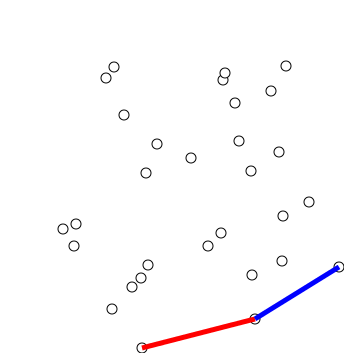

# Convex Hull

[TOC]

## Problem

A convex hull is designed to solve the problem of **finding the smallest convex shape that contains a set of points**.

- Which points form the outer boundary of a point set?
- How can a scattered point set be replaced by a simple enclosing polygon?
- How can geometric algorithms remove interior points that cannot affect the boundary?

For a point set $P$, the convex hull is:
$$
\operatorname{conv}(P)
$$

It is the smallest convex set containing every point in $P$.

## Core Idea

The convex hull keeps only the extreme points of the set.

For a planar point set, the output is a convex polygon whose vertices are selected from the input points.

The practical essence of convex hull construction is:

1. **Find points that lie on the outside**
2. **Order them around the boundary**
3. **Discard points that would create an inward turn**

## Solution

### Orientation Test

Most 2D convex hull algorithms rely on the orientation of three points.

For points $a, b, c$:
$$
\operatorname{cross}(b-a, c-a)
=
(b_x-a_x)(c_y-a_y) - (b_y-a_y)(c_x-a_x)
$$

- positive: counterclockwise turn
- negative: clockwise turn
- zero: collinear

This test decides whether the boundary is still convex.

### Graham Scan

Graham scan is a standard convex hull algorithm for planar points.

#### Find A Pivot

Choose the bottom-most point. If there is a tie, choose the left-most one.

This point is guaranteed to lie on the convex hull.

#### Sort By Polar Angle

Sort all other points by polar angle around the pivot.

This produces a radial traversal order around the point set.

#### Maintain A Stack

Traverse the sorted points and maintain a stack of hull vertices.

For each new point:

1. Look at the last two points on the stack.
2. Test the orientation with the new point.
3. If the turn is not counterclockwise, pop the last point.
4. Repeat until the boundary is convex again.
5. Push the new point.

At the end, the stack contains the hull vertices in boundary order.

### Monotone Chain

Andrew's monotone chain algorithm is another common implementation.

It sorts points lexicographically and builds:

- a lower hull
- an upper hull

Each part uses the same orientation test and stack logic.

Monotone chain is often easier to implement robustly than polar-angle sorting.

### Output

For $n$ input points and $h$ hull vertices, the output is:

$$
H = [p_1, p_2, ..., p_h]
$$

ordered around the convex boundary.

##  Boundaries

### Degenerate Inputs

Special handling is needed for:

- duplicate points
- all points collinear
- repeated boundary points
- very small point sets

The hull of one point is a point. The hull of two distinct points is a segment.

### Collinear Boundary Points

Some applications keep all points on the boundary. Others keep only the extreme endpoints of each straight edge.

The orientation comparison must match the desired convention.

### Floating-Point Robustness

Nearly collinear points can cause unstable orientation tests.

Robust implementations may use exact predicates or an epsilon policy based on input scale.

### Higher Dimensions Are Harder

In 3D, the convex hull is a convex polyhedron instead of a polygon. Algorithms and degeneracy handling become more complex.

Common 3D methods include Quickhull and incremental hull construction.

## Cost

The main cost of convex hull construction lies in the trade-off between **sorting or searching boundary order** and **robust geometric predicates**.

### Time Cost

- Graham scan: **O(n log n)**
- Monotone chain: **O(n log n)**
- Gift wrapping: **O(nh)** where $h$ is the number of hull vertices
- Orientation test: **O(1)**

The sorting step usually dominates Graham scan and monotone chain.

### Space Cost

The hull stack requires:
$$
O(n)
$$

in the worst case.

### Engineering Cost

In real systems, implementing a convex hull requires careful decisions about:

- duplicate removal
- collinearity convention
- clockwise or counterclockwise output order
- exact versus approximate predicates
- whether to keep or discard boundary collinear points

So while the algorithm is short, correctness depends heavily on orientation semantics.
