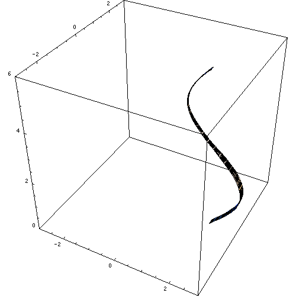

# Geometric Construction

[TOC]

## Problem

Geometric construction is designed to solve the problem of **building usable geometric objects from mathematical descriptions, samples, and editing operations**.

- How is a curve, surface, mesh, or solid represented?
- How is a shape generated from equations, primitives, or control points?
- How is continuous geometry converted into samples, polygons, voxels, or meshes?
- How is geometry edited, deformed, repaired, or enriched with detail?

Typical inputs include:

- analytic equations
- curves and surfaces
- point clouds
- scalar fields
- polygonal boundaries
- images and height fields
- control points and deformation handles

Typical outputs include:

- point sets
- polylines
- triangle meshes
- tetrahedral meshes
- implicit fields
- parametric surfaces
- solid models

## Core Idea

Geometric construction is mostly a problem of choosing the right representation and converting between representations safely.

Different operations are simple in different forms:

- implicit fields are good for inside-outside tests and contour extraction
- parametric curves are good for smooth evaluation and design control
- meshes are good for rendering, simulation, and fabrication
- point clouds are good for scanned or sampled data
- voxels are good for volumetric processing
- boundary representations are good for CAD solids

The practical essence of geometric construction is:

1. **Choose a representation that matches the operation**
2. **Generate or transform geometry in that representation**
3. **Discretize continuous objects when computation requires finite data**
4. **Validate topology and numerical robustness**
5. **Convert to the representation needed by the next stage**

## Solution

### Representation

Different algorithms become natural under different geometric representations.

| Representation | Form | Good for | Common operations |
| :--- | :--- | :--- | :--- |
| Explicit graph | $z=f(x,y)$ | height fields, terrain | sampling, interpolation, displacement |
| Implicit equation | $f(x)=0$ | closed curves and surfaces | inside-outside test, boolean operations, contouring |
| Signed distance field | $\phi(x)$ | robust solids, level sets | offset, blending, collision, ray marching |
| Parametric curve | $\gamma(t)$ | curves, trajectories | evaluation, subdivision, arc-length sampling |
| Parametric surface | $x(u,v)$ | smooth surfaces | tessellation, texture coordinates, differential geometry |
| Point cloud | $\{p_i\}_{i=1}^n$ | scanned or sampled geometry | reconstruction, normal estimation, registration |
| Polygon or mesh | $(V,E,F)$ | rendering, simulation, fabrication | triangulation, smoothing, simplification, remeshing |
| Voxel grid | $V[i,j,k]$ | volumetric data | morphology, marching cubes, flood fill |
| Boundary representation | faces, edges, vertices with topology | CAD solids | trimming, sewing, boolean operations |
| Constructive solid geometry | expression tree of primitives and booleans | procedural solids | union, intersection, difference |

### Construction Pipeline

A practical geometric construction pipeline usually follows this pattern:

1. Define geometry using primitives, equations, samples, or control points.
2. Choose the representation needed for the next operation.
3. Generate a base shape through primitive construction, extrusion, revolution, sweep, lofting, or boolean composition.
4. Discretize the shape into samples, polylines, triangles, tetrahedra, or voxels.
5. Repair and validate intersections, orientation, degeneracies, and boundary conditions.
6. Edit or deform the shape using handles, lattices, physical models, or differential coordinates.
7. Add detail with procedural noise, displacement, subdivision, or texture-driven geometry.
8. Export the result in the representation required by rendering, simulation, fabrication, or analysis.

### Primitive Construction

Primitive construction builds objects from elementary geometric entities.

Common analytic primitives include:

- line, ray, and segment
- plane
- circle and ellipse
- sphere, cylinder, cone, and torus
- quadric surface:
  $$
  x^TAx + b^Tx + c = 0
  $$

These primitives are useful because many of their geometric queries have exact formulas.

### Parametric Modeling

Parametric curves and surfaces describe geometry by mapping parameters into space:
$$
\gamma(t): [0,1] \to \mathbb{R}^n
$$

$$
x(u,v): \Omega \subset \mathbb{R}^2 \to \mathbb{R}^3
$$

Important families include:

- Bezier curves and surfaces
- B-spline curves and surfaces
- NURBS
- subdivision surfaces

Related note:

- [Bezier Curve](./Bezier_Curve.md)

### Solid Construction

Solid construction creates 3D objects from lower-dimensional geometry or from other solids.

#### Extrusion

Extrusion moves a planar region $R$ along a direction $d$:
$$
S = \{p + td \mid p \in R,\ t \in [0,h]\}
$$

#### Revolution

Revolution rotates a curve or region around an axis.

For a profile curve $(r(t),z(t))$ around the $z$-axis:
$$
x(t,\theta)=
\begin{bmatrix}
r(t)\cos\theta \\
r(t)\sin\theta \\
z(t)
\end{bmatrix}
$$

#### Sweep

A sweep moves a cross section along a path. The cross section may keep a fixed orientation, follow a moving frame, or change scale along the path.

Common issues include frame twisting, self-intersection, and sharp path corners.

#### Loft

Lofting constructs a surface or solid that interpolates multiple cross sections.

#### Offset And Thickening

An offset surface moves points along normals:
$$
x_{offset}(u,v) = x(u,v) + dn(u,v)
$$

Offsets are difficult near high curvature, sharp features, and self-intersections.

#### Boolean Operations

Boolean operations combine solids:

- union: $A \cup B$
- intersection: $A \cap B$
- difference: $A \setminus B$

They are natural for implicit representations and CSG trees, but mesh and B-rep booleans require robust intersection and topology handling.

### Sampling

Sampling converts continuous geometry into finite points.

For a parameterization:
$$
\gamma:\Omega \subset \mathbb{R}^n \to M \subset \mathbb{R}^m
$$

the intrinsic volume element is:
$$
dV_M = \sqrt{\det(J_\gamma^TJ_\gamma)}\,dx
$$

Uniform sampling should account for this metric distortion.

Related note:

- [Uniform Sampling On Manifolds](./uniform%20sampling%20on%20manifolds.md)

### Discretization And Meshing

Meshing converts geometry into combinatorial elements such as segments, triangles, quads, tetrahedra, or voxels.

Common tasks include:

| Task | Input | Output | Typical algorithms |
| :--- | :--- | :--- | :--- |
| Polygon triangulation | simple polygon | triangle set | ear clipping, monotone partition |
| Point-set triangulation | planar point set | triangle mesh | Delaunay triangulation |
| Convex enclosure | point set | convex polygon or polytope | Graham scan, monotone chain, Quickhull |
| Iso-surface extraction | scalar field | triangle mesh | Marching Cubes, Dual Contouring |
| Tetrahedralization | 3D domain | tetrahedral mesh | constrained Delaunay, quality meshing |

Related notes:

- [Triangulating A Simple Polygon](./triangulating%20a%20simple%20polygon.md)
- [Triangulation Of Point Set In Euclidean Space](./triangulation%20of%20point%20set%20in%20euclidean%20space.md)
- [Convex Hull](./convex%20hull.md)
- [Contour Surface](./contour%20surface.md)

### Surface Reconstruction

Surface reconstruction builds a surface from point samples.

Typical inputs include:

- point positions
- estimated normals
- scanner confidence
- known boundary curves

Common methods include:

| Method | Input | Idea |
| :--- | :--- | :--- |
| Alpha shape | points and scale $\alpha$ | keep simplices selected by a radius threshold |
| Ball Pivoting | oriented points and ball radius | roll a ball over samples to create triangles |
| Poisson reconstruction | oriented points | solve an implicit indicator-function problem |
| Moving Least Squares | points | fit local smooth approximating surfaces |

Key difficulties include normal estimation, holes, outliers, nonuniform density, and sharp-feature preservation.

### Deformation And Editing

Geometric deformation changes shape while preserving selected properties such as smoothness, local rigidity, volume, or boundary constraints.

Common deformation models include:

- lattice-based deformation
- skeleton-based skinning
- Laplacian surface editing
- as-rigid-as-possible deformation
- elastic deformation
- mass-spring and finite element models

Related notes:

- [Free-Form Deformation](./free-form%20deformation.md)
- [Elastically Deformable Models](./elastically%20deformable%20models.md)

### Procedural Detail Generation

Procedural methods add geometric or visual detail without manually modeling every feature.

Examples include:

- gradient noise
- fractal noise
- displacement mapping
- L-systems
- reaction-diffusion patterns
- procedural cracks, pores, wrinkles, and erosion

Related note:

- [Noise Generation](./noise%20generation.md)

### Geometric Queries

Construction algorithms often depend on low-level predicates and queries.

Important examples include:

- orientation test
- point-in-polygon and point-in-polyhedron
- segment, ray, triangle, and surface intersection
- nearest point and distance query
- bounding volume overlap
- normal and curvature estimation
- connected components and boundary loops

Related notes:

- [Intersection](../geometric%20problem/Intersection.md)
- [Intersection of Ray and Surface in Flat Space](../geometric%20problem/Intersection_of_Ray_Surface_in_Flat_Space.md)
- [Intersection of Ray and Surface in Curvature Space](../geometric%20problem/Intersection_of_Ray_Surface_in_Curvature_Space.md)

##  Boundaries

### Representation Mismatch

Many failures come from using a representation that does not match the operation.

For example:

- mesh booleans are harder than implicit booleans
- uniform parameter sampling may not be uniform on the surface
- point clouds do not directly contain topology
- voxel grids lose detail below cell resolution

### Numerical Robustness

Geometric construction is sensitive to floating-point error and degeneracy.

Common failure cases include:

- nearly collinear or coplanar points
- duplicate vertices
- tiny edges and sliver triangles
- self-intersections
- inconsistent face orientation
- non-manifold edges and vertices
- holes and open boundaries
- ambiguous inside-outside classification

Typical remedies include:

- exact or adaptive geometric predicates
- epsilon policies tied to model scale
- symbolic perturbation
- snapping and welding
- topology validation
- robust boolean and intersection kernels
- post-processing repair passes

### Topology Is Hard To Preserve

Sampling, meshing, simplification, and deformation can change topology accidentally.

Examples include cracks, flipped triangles, collapsed components, and unwanted holes.

### Continuous Objects Need Discretization

Most computations eventually use finite samples or finite elements. This introduces resolution, approximation, and aliasing issues.

### Robust Libraries Are Often Necessary

Production CAD, simulation, GIS, and geometry-processing systems usually rely on robust kernels rather than ad hoc implementations.

## Cost

The main cost of geometric construction lies in the trade-off between **expressive shape operations** and **robust representation conversion**.

### Time Cost

Costs vary by task:

- curve evaluation: often **O(n)** in degree or control count
- polygon triangulation: often **O(n^2)** for simple ear clipping
- Delaunay triangulation: often **O(n log n)**
- Marching Cubes: **O(N)** in the number of grid cells
- mesh repair and boolean operations: highly input-dependent
- physical deformation: dominated by solver cost

### Space Cost

Space depends on representation:

- control-point curves: compact
- triangle meshes: linear in vertices, edges, and faces
- voxel grids: can be large in 3D
- tetrahedral meshes: larger than surface meshes
- implicit procedural fields: compact if evaluated analytically

### Engineering Cost

In real systems, geometric construction requires careful decisions about:

- representation choice
- unit and coordinate conventions
- boundary conditions
- indexing and orientation
- numeric predicates
- topology validation
- resolution and tolerance
- conversion between analytic, implicit, parametric, and discrete forms

So geometric construction is not one algorithm. It is a pipeline discipline: choose the right model, apply the right construction, and preserve enough geometry and topology for the next operation.

## Topic Map

Existing notes in this folder:

- [Bezier Curve](./Bezier_Curve.md)
- [Contour Surface](./contour%20surface.md)
- [Convex Hull](./convex%20hull.md)
- [Elastically Deformable Models](./elastically%20deformable%20models.md)
- [Free-Form Deformation](./free-form%20deformation.md)
- [Noise Generation](./noise%20generation.md)
- [Triangulating A Simple Polygon](./triangulating%20a%20simple%20polygon.md)
- [Triangulation Of Point Set In Euclidean Space](./triangulation%20of%20point%20set%20in%20euclidean%20space.md)
- [Uniform Sampling On Manifolds](./uniform%20sampling%20on%20manifolds.md)

Useful missing notes:

- Signed distance fields
- Constructive solid geometry
- Sweep, loft, offset, and thickening
- Marching Squares
- Dual Contouring
- Tetrahedral meshing
- Surface reconstruction from point clouds
- Normal and curvature estimation
- Mesh smoothing, subdivision, simplification, and remeshing
- B-spline and NURBS
- Subdivision surfaces
- Laplacian deformation and ARAP deformation
- Robust geometric predicates
