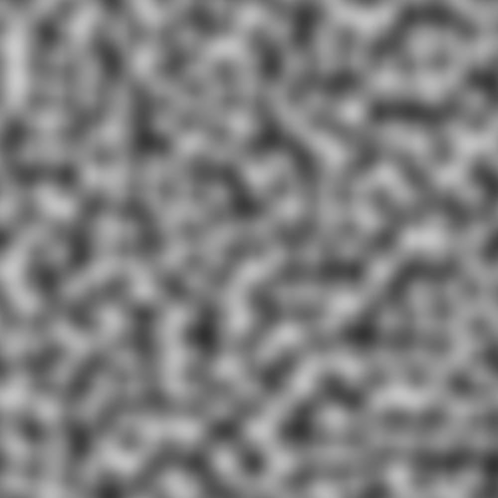
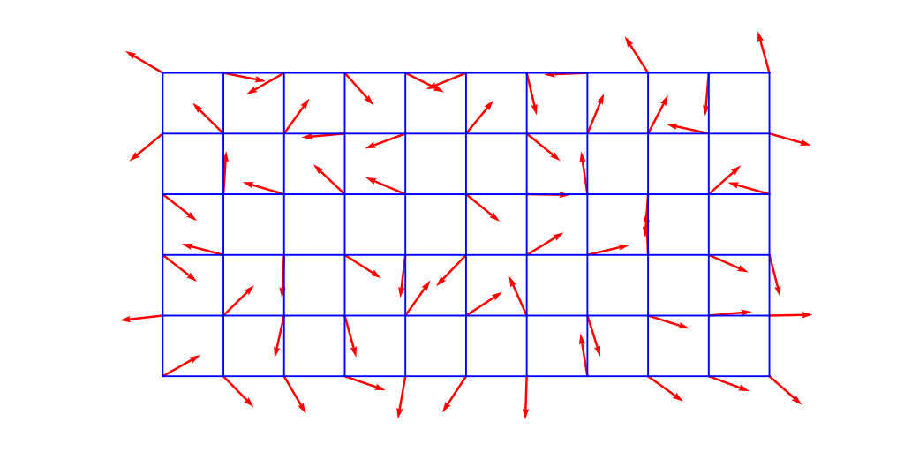
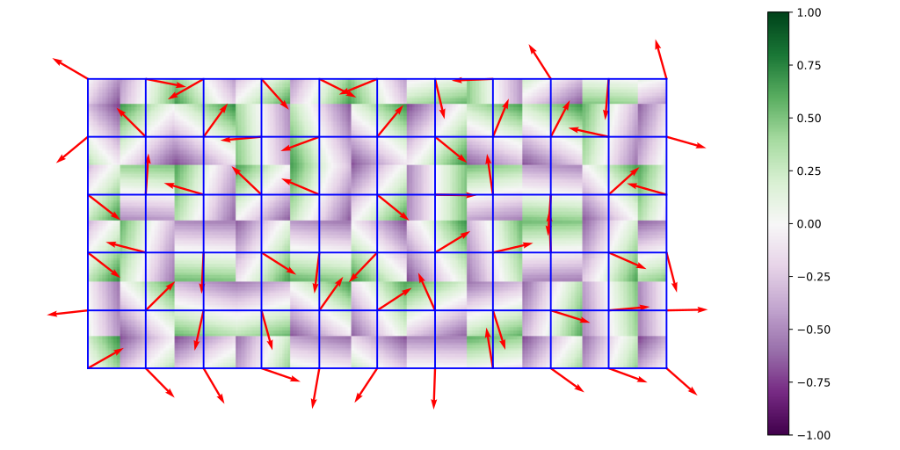
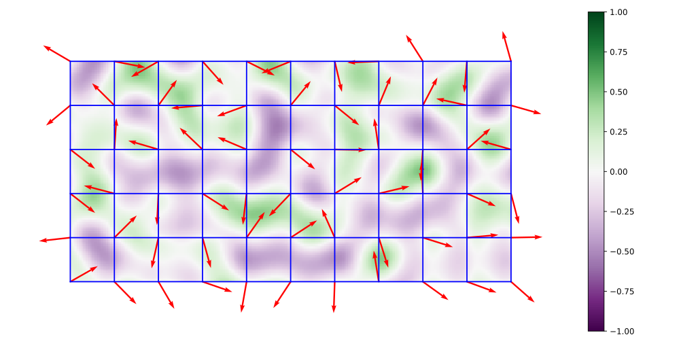
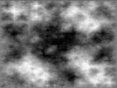

# Noise Generation

[TOC]

## Problem

Noise generation is designed to solve the problem of **creating controlled randomness for geometry, texture, terrain, and simulation**.

- How can natural-looking variation be generated procedurally?
- How can surfaces avoid perfect smoothness or repetition?
- How can synthetic data include perturbations for robustness testing?

Noise functions convert coordinates and parameters into repeatable pseudo-random values:
$$
noise : \mathbb{R}^n \to \mathbb{R}
$$

## Core Idea

Procedural noise is not pure random sampling at every point. It is structured randomness.

A good geometric noise function is usually:

- deterministic for the same input
- spatially coherent
- controllable by scale and amplitude
- cheap to evaluate

The practical essence of noise generation is:

1. **Create local random structure**
2. **Interpolate or combine it smoothly**
3. **Layer multiple frequencies for richer detail**

## Solution

### Perlin Noise

Perlin noise is a gradient noise function.

Instead of assigning random values directly to grid points, it assigns random gradient vectors to grid points and interpolates their local influence.

### Perlin Noise Process

For a query point $x$:

1. Find the grid cell containing $x$.
2. Read the pseudo-random gradient vector at each grid corner.
3. Compute the displacement vector from each corner to $x$.
4. Take dot products between gradients and displacement vectors.
5. Smoothly interpolate the dot products.

### Smooth Interpolation

Linear interpolation is:
$$
lerp(a,b,t) = (1-t)a + tb
$$

For smoother visual results, Perlin noise often uses a fade function:
$$
fade(t) = 6t^5 - 15t^4 + 10t^3
$$

This gives zero first and second derivatives at cell boundaries.

### Fractal Noise

Multiple layers of noise can be combined:
$$
F(x) = \sum_{i=0}^{k-1} A_i\,noise(2^i x)
$$

where $A_i$ usually decreases with frequency.

Common parameters:

- frequency: controls feature size
- amplitude: controls displacement strength
- octave count: controls number of layers
- persistence: controls amplitude decay
- lacunarity: controls frequency growth

This produces richer terrain, clouds, marble, wood grain, and displacement fields.

### Diamond-Square Algorithm

The diamond-square algorithm generates fractal heightmaps on a square grid of size:
$$
2^n + 1
$$

It alternates two steps:

#### Diamond Step

For each square, set the center value to the average of the four corners plus a random offset.

#### Square Step

For each diamond, set the center value to the average of neighboring points plus a random offset.

The random offset decreases at each level, producing coarse-to-fine terrain detail.

### Applying Noise To Geometry

Noise can be used to modify geometry by:

- displacing vertices along normals
- perturbing point positions
- generating procedural height fields
- varying material parameters
- creating erosion-like or natural surface details

For a surface point $p$ with normal $n(p)$:
$$
p' = p + A \cdot noise(p) \cdot n(p)
$$

##  Boundaries

### Noise Is Not Randomness Alone

Independent random values at each point produce static or salt-and-pepper artifacts. Geometry usually needs coherent noise.

### Grid Artifacts Can Appear

Gradient noise can reveal grid structure if the implementation, interpolation, or frequency choice is poor.

Simplex noise and domain warping are common alternatives when artifacts are visible.

### Aliasing Requires Filtering

High-frequency noise can alias when sampled too coarsely.

Texture and displacement pipelines often need mipmapping, band limiting, or adaptive sampling.

### Determinism Requires A Stable Hash

Procedural generation usually expects the same seed and coordinates to produce the same result across runs.

Floating-point differences and hash choices can affect reproducibility.

### Natural Appearance Needs Composition

One noise layer is often too simple. Realistic procedural detail usually combines multiple octaves, masks, warping, and domain-specific constraints.

## Cost

The main cost of noise generation lies in the trade-off between **procedural richness** and **evaluation cost**.

### Time Cost

- Value noise or gradient noise at one point: **O(1)**
- Fractal noise with $k$ octaves: **O(k)**
- Applying noise to $N$ vertices: **O(Nk)**
- Diamond-square heightmap generation: **O(N^2)** for an $N \times N$ grid

### Space Cost

Hash-based noise can be evaluated with:
$$
O(1)
$$

extra storage.

Precomputed gradient tables or heightmaps require storage proportional to table or grid size.

### Engineering Cost

In real systems, implementing procedural noise requires careful decisions about:

- coordinate scale
- seeding and hashing
- interpolation function
- octave composition
- anti-aliasing
- repeatability and tiling
- whether noise is evaluated in object, world, or texture space

So noise generation is simple at one point, but visual quality depends on how noise is composed and sampled.
