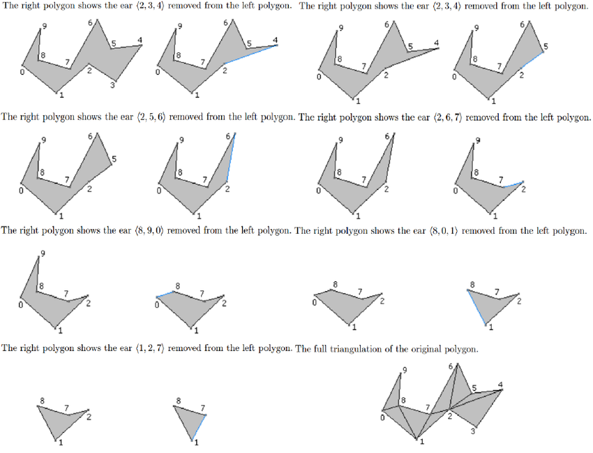

# Triangulating A Simple Polygon

[TOC]

## Problem

Polygon triangulation is designed to solve the problem of **decomposing a simple polygon into non-overlapping triangles**.

- How can a polygon be rendered by triangle-based hardware?
- How can a planar region be decomposed for simulation or integration?
- How can polygon geometry be reduced to simpler primitive elements?

A simple polygon has no holes and no self-intersections. For an $n$-vertex simple polygon, a triangulation contains:
$$
n - 2
$$

triangles.

## Core Idea

Every simple polygon with at least four vertices has at least one **ear**.

An ear is a triangle formed by three consecutive polygon vertices:
$$
(v_{i-1}, v_i, v_{i+1})
$$

such that:

- the angle at $v_i$ is convex
- the triangle lies inside the polygon
- no other polygon vertex lies inside the triangle

The practical essence of ear clipping is:

1. **Find a removable ear**
2. **Output that ear as a triangle**
3. **Remove the ear vertex and repeat**



## Solution

### Orientation Test

Assume the polygon vertices are ordered counterclockwise.

For three consecutive vertices $a, b, c$, compute:
$$
\operatorname{cross}(b-a, c-b)
=
(b_x-a_x)(c_y-b_y) - (b_y-a_y)(c_x-b_x)
$$

If the value is positive, the vertex $b$ is convex under the counterclockwise convention.

If the input polygon is clockwise, the sign convention is reversed.

### Ear Test

A vertex $b$ is an ear tip if:

1. $a,b,c$ form a convex turn.
2. The triangle $(a,b,c)$ contains no other polygon vertex.
3. The diagonal $(a,c)$ lies inside the polygon.

For simple polygons, the first two checks are often enough in a standard ear-clipping implementation when the polygon is consistently oriented.

### Basic Implementation

```python
def cross(a, b, c):
    return (b[0] - a[0]) * (c[1] - b[1]) - (b[1] - a[1]) * (c[0] - b[0])


def is_convex(a, b, c):
    return cross(a, b, c) > 0


def is_ear(a, b, c, polygon):
    if not is_convex(a, b, c):
        return False

    for p in polygon:
        if p == a or p == b or p == c:
            continue
        if point_in_triangle(p, a, b, c):
            return False

    return True
```

The exact `point_in_triangle` test should use the same orientation convention as the convexity test.

### Ear Clipping Process

1. Store the polygon vertices in cyclic order.
2. Find all candidate ears.
3. Select one ear $(v_{i-1}, v_i, v_{i+1})$.
4. Output this triangle.
5. Remove $v_i$ from the polygon.
6. Recheck the neighboring vertices.
7. Repeat until only one triangle remains.

### Output

The output is a list of triangles:
$$
T = \{(a_1,b_1,c_1), ..., (a_{n-2},b_{n-2},c_{n-2})\}
$$

Their interiors do not overlap and their union equals the polygon interior.

##  Boundaries

### Input Must Be Simple

Ear clipping assumes the polygon has no self-intersections.

If the input is self-intersecting, the meaning of the interior becomes ambiguous and the algorithm may fail.

### Holes Need Extra Handling

A polygon with holes is not directly handled by basic ear clipping.

Common approaches include:

- bridge holes to the outer boundary
- use constrained triangulation
- use a library designed for polygon arrangements

### Orientation Must Be Consistent

The convexity test depends on whether the boundary is clockwise or counterclockwise.

It is common to compute signed area first and reverse the polygon if necessary.

### Degenerate Vertices Cause Problems

Duplicate points, collinear chains, tiny edges, and nearly collinear triples can make ear tests unstable.

Preprocessing often removes redundant vertices.

## Cost

The main cost of ear clipping lies in the trade-off between **simple implementation** and **quadratic search for ears**.

### Time Cost

- Naive ear search: **O(n^2)**
- Convexity test: **O(1)**
- Point-in-triangle scan for one candidate: **O(n)**
- Output triangle count: **O(n)**

More advanced polygon triangulation algorithms can achieve **O(n log n)** or even **O(n)**, but they are more complex.

### Space Cost

The polygon list and output triangles require:
$$
O(n)
$$

### Engineering Cost

In real systems, implementing polygon triangulation requires careful decisions about:

- polygon orientation
- degenerate vertex cleanup
- exact or approximate predicates
- hole handling
- preserving input boundary constraints
- returning indices versus copied coordinates

So ear clipping is attractive for simple polygons, but robust production triangulation needs careful preprocessing.
