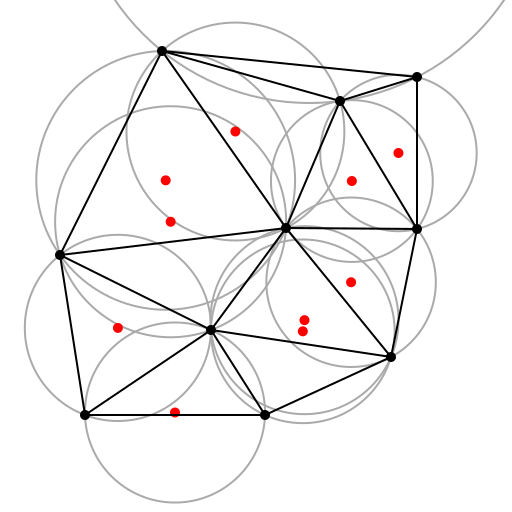
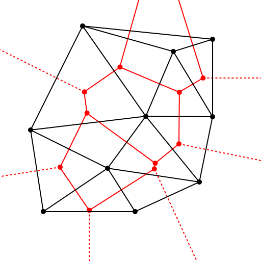
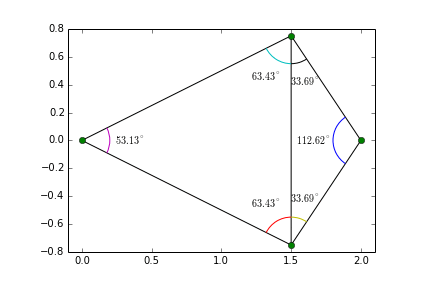

# Triangulation Of Point Set In Euclidean Space

[TOC]

## Problem

Point-set triangulation is designed to solve the problem of **connecting discrete points into a triangle mesh**.

- How can a planar point set be converted into triangles?
- How can interpolation be performed over scattered samples?
- How can a mesh avoid long, skinny triangles when possible?

For a point set $P \subset \mathbb{R}^2$, a triangulation connects points by non-crossing edges so that the convex hull of $P$ is decomposed into triangles.

## Core Idea

Delaunay triangulation is the standard high-quality triangulation for point sets.

For a point set $P$, a triangulation $DT(P)$ is Delaunay if no point in $P$ lies strictly inside the circumcircle of any triangle in the triangulation.

The practical essence of Delaunay triangulation is:

1. **Connect nearby points**
2. **Avoid skinny triangles**
3. **Use the empty circumcircle condition as the local optimality rule**

## Solution

### Empty Circumcircle Property

For every triangle $\triangle abc$ in the triangulation, its circumcircle should contain no other input point in its interior.

This local condition defines the Delaunay triangulation under general position assumptions.

### Voronoi Duality

Delaunay triangulation is dual to the Voronoi diagram.

Two points share a Delaunay edge if and only if their Voronoi cells share an edge.

This means Delaunay edges often connect natural neighbors.

### Angle Property

Delaunay triangulation maximizes the minimum angle among all triangulations of the same point set.

It tends to avoid very thin triangles, although it does not minimize total edge length.

### Incremental Algorithm

A common construction method inserts points one at a time.

1. Start with a large super-triangle containing all points.
2. Insert one point.
3. Find triangles whose circumcircles contain the point.
4. Remove those triangles, creating a cavity.
5. Retriangulate the cavity by connecting the new point to its boundary.
6. Remove triangles connected to the super-triangle vertices.

This is often called the Bowyer-Watson algorithm.

### Edge Flip Algorithm

Another view starts from any valid triangulation.

For two adjacent triangles sharing an edge, check whether the opposite vertex lies inside the circumcircle of the other triangle. If it does, flip the shared edge.

Repeat until no illegal edge remains.

### Other Algorithms

Common Delaunay construction methods include:

- divide and conquer
- sweep line
- randomized incremental insertion
- lifting to a convex hull in one higher dimension

##  Boundaries

### General Position Assumption

If four or more points lie on the same circle, the Delaunay triangulation may not be unique.

The algorithm must choose a consistent tie-breaking rule.

### Convex Hull Boundary

Without constraints, the triangulation fills the convex hull of the point set.

If a non-convex domain boundary must be preserved, use constrained Delaunay triangulation.

### Not A Surface Reconstruction By Itself

2D Delaunay triangulation works for planar point sets.

For 3D point clouds sampled from surfaces, surface reconstruction requires additional assumptions and algorithms.

### Robust Predicates Matter

The orientation test and in-circle test are sensitive to floating-point error.

Robust Delaunay implementations often use exact or adaptive predicates.

## Cost

The main cost of point-set triangulation lies in the trade-off between **mesh quality** and **geometric predicate complexity**.

### Time Cost

- Randomized incremental Delaunay: expected **O(n log n)**
- Divide and conquer Delaunay: **O(n log n)**
- Naive incremental insertion: can degrade to **O(n^2)**
- Edge legality test: **O(1)** per tested edge

### Space Cost

A planar triangulation has linear complexity:
$$
O(n)
$$

For $n$ points with $h$ points on the convex hull, the number of triangles is:
$$
2n - 2 - h
$$

under non-degenerate planar conditions.

### Engineering Cost

In real systems, implementing Delaunay triangulation requires careful decisions about:

- exact orientation and in-circle predicates
- duplicate point handling
- cocircular point tie-breaking
- adjacency data structures
- constrained edges and domain boundaries
- mapping triangle output back to input indices

So Delaunay triangulation is mathematically elegant, but robust implementations are predicate-heavy.
