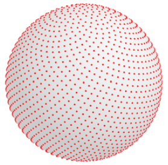
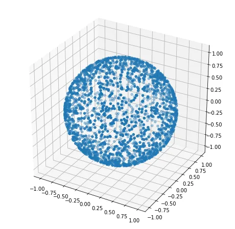

# Uniform sampling on manifolds

[TOC]

## Problem

Uniform sampling on manifolds refers to the process of generating points on a manifold in a way that ensures each region of the manifold has an approximately equal probability of being sampled. A uniform sampling $P$ or $S$ (for sampling) on a manifold $M$ can be defined as a probability measure $P$ or a sampling operator $S$ such that, for any measurable subset $A$ of $M$, the probability of sampling a point in $A$ is proportional to the "size" or "volume" of $A$ with respect to the intrinsic geometry of the manifold. Thus, this problem is to find a workable sampling method that satisfies these conditions.

$$
P(A) \propto \text{Vol}_M(A)
$$

- $P(A)$ is the probability of sampling a point in $A$
- $\text{Vol}_M(A)$ is the volume of $A$ with respect to the intrinsic geometry of the manifold $M$.

## Resolution

### Sampling via Parameterization

Assume the manifold is parameterized by $\gamma : \Omega \subset \mathbb{R}^n \rightarrow M \subset \mathbb{R}^m$, $\gamma(\mathbf{x}) = (x_1(\mathbf{x}), x_2(\mathbf{x}), ..., x_m(\mathbf{x}))$, where $\mathbf{x} = (x_1,\dots,x_n)$ is a parameter vector. Sampling uniformly on (M) requires correcting for metric distortion introduced by the parameterization. +For one-to-one mapping of random variables $g: x \to y$ and random vectors $g: \boldsymbol  x \to \boldsymbol  y$, the transformation between distributions is like,
$$
f_{\boldsymbol Y}(\boldsymbol y) = \frac{1}{|\det(J_g)|} f_{\boldsymbol X}(g^{-1}(\boldsymbol y))
$$

$$
f_{\vec{X}}(\vec{x})=\frac{\sqrt{\operatorname{det}\left(J_{\gamma}^{T} J_{\gamma}\right)}}{\int_{\Omega} \sqrt{\operatorname{det}\left(J_{\gamma}^{T} J_{\gamma}\right)} d x^{n}}, \vec{x} \in \Omega
$$

- $J_\gamma$ is the Jacobian matrix of the parameterization.
- $G = J_\gamma^T J_\gamma$ is the local metric tensor.
- $dV_M =\sqrt{\det(J_\gamma^T J_\gamma)} , d\mathbf{x}$ is the intrinsic volume element on the manifold.

### Grid sampling

Random sampling is not the only approach. Deterministic point sets with good spatial distribution are also used. These are often called **low-discrepancy sequences**.

Fibonacci Lattice: The **Fibonacci lattice** provides nearly uniform point distributions on a sphere or disk.
$$
x_i = \sqrt{1-z_i^2}\cos(\theta_i)\\
y_i = \sqrt{1-z_i^2}\sin(\theta_i)\\
z_i = z_i
$$

- $\phi = \frac{1+\sqrt{5}}{2}$ is the golden ratio.
- $i = 0,1,\dots,N-1$
- $z_i = 1 - \frac{2i+1}{N}$
- $\theta_i = 2\pi \frac{i}{\phi}$

## Include

### Uniform sampling of spherical surfaces

$$
\begin{align*}
\xi_1, \xi_2 &\sim \text{Uniform}[0, 1]\\
\theta &= \arccos(1-2\xi_1)\\
\varphi &= 2\pi \xi_2 \\
x &= r \sin(\theta) \cos(\varphi) \\
y &= r \sin(\theta) \sin(\varphi) \\
z &= r \cos(\theta)
\end{align*}
$$

