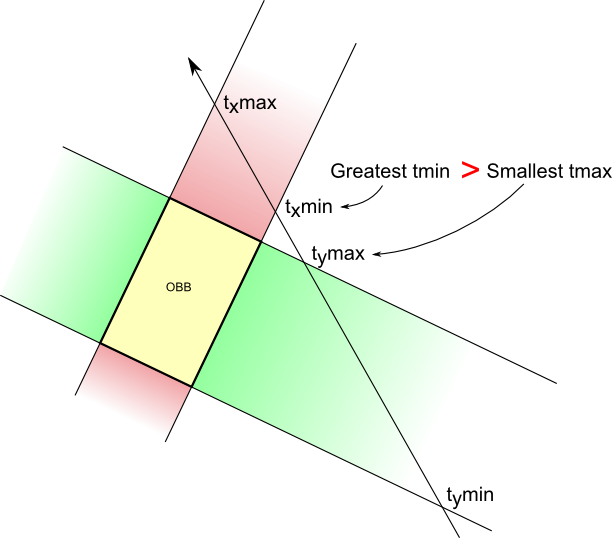

# Intersection of Ray-Surface in Flat Space

[TOC]

## Problem

$$
\begin{align*}
\boldsymbol x(t) &= \boldsymbol x_0 + t \hat{\boldsymbol d} \tag{ray} \\
f(\boldsymbol x) &= 0 \tag{surface} \\
\\
\Rightarrow \quad f(\boldsymbol x_0 + t \hat{\boldsymbol d}) &= 0
\end{align*}
$$

Intersection points of Ray-Surface refer to the solution of ray and surface equation system. For a ray and a surface, we want to connect two equations and solve $t = \text{distance}(\text{ray}, \text{surface})$.

- $t$: The distance from the origin of the ray to the intersection of ray-surface.

## Include

### Ray-Plane

$$
\boldsymbol a^T \boldsymbol x = b  \tag{plane}
$$

Solution: 

$$
\begin{align*}
  t &= \frac{\boldsymbol a^T \boldsymbol x_0 - b}{\boldsymbol a^T \hat{\boldsymbol d}}  \\
    &= \frac{\left(\sum\limits_{i=1}^{\dim} a_i x_{0i} \right) - b}{\sum\limits_{i=1}^{\dim} a_i d_i}  \tag{分量形式}			
\end{align*}
$$

> Proof
> $$
> \begin{align*}
> \Rightarrow\quad \boldsymbol a^T (\boldsymbol x_0 + t \hat{\boldsymbol d}) - b &= 0  \\
>   t \boldsymbol a^T \hat{\boldsymbol d} + (\boldsymbol a^T \boldsymbol x_0 - b) &= 0  \\
>   t &= \frac{\boldsymbol a^T \boldsymbol x_0 - b}{\boldsymbol a^T \hat{\boldsymbol d}}
> \end{align*}
> $$

### Ray-Triangle

For three vertices of a given triangle $\{\boldsymbol v_1, \boldsymbol v_2, \boldsymbol v_3\}$

Solution: 

$$
\begin{align*}
t &= \frac{(\boldsymbol x_0 - \boldsymbol v_1) × \boldsymbol e_1·\boldsymbol e_2}{\hat{\boldsymbol d} × \boldsymbol e_2·\boldsymbol e_1}  \\
u &= \frac{\hat{\boldsymbol d} × \boldsymbol e_2· (\boldsymbol x_0 - \boldsymbol v_1)}{\hat{\boldsymbol d} × \boldsymbol e_2·\boldsymbol e_1}  \\
v &= \frac{(\boldsymbol x_0 - \boldsymbol v_1) × \boldsymbol e_1· \hat{\boldsymbol d}}{\hat{\boldsymbol d} × \boldsymbol e_2·\boldsymbol e_1}  \\
\boldsymbol e_1 &= \boldsymbol v_2 - \boldsymbol v_1  \\
\boldsymbol e_2 &= \boldsymbol v_3 - \boldsymbol v_1
\end{align*}
$$

- **Intersection Condition**: $u ≥ 0, v ≥ 0, u + v ≤ 1$

> Proof
> $$
> \begin{align*}
>   \boldsymbol x_0 + t \hat{\boldsymbol d} &= (1 - u - v) \boldsymbol v_1 + u \boldsymbol v_2 + v \boldsymbol v_3  \\
>   \Rightarrow\quad \boldsymbol x_0 - \boldsymbol v_1 &=\left(\begin{matrix}-\hat{\boldsymbol d} & \boldsymbol v_2 - \boldsymbol v_1 & \boldsymbol v_3-\boldsymbol v_1 \end{matrix}\right) \left(\begin{matrix}t \\ u \\ v \end{matrix}\right)   \\
>   &= \left(\begin{matrix}-\hat{\boldsymbol d} & \boldsymbol e_1 & \boldsymbol e_2 \end{matrix}\right) \left(\begin{matrix}t \\ u \\ v \end{matrix}\right)  \tag{$\boldsymbol e_1 = \boldsymbol v_2 - \boldsymbol v_1, \boldsymbol e_2 = \boldsymbol v_3 - \boldsymbol v_1$}
> \end{align*}
> $$
>
> $$
> \begin{align*}
>   t &= \frac{\left|\begin{matrix}  (\boldsymbol x_0 - \boldsymbol v_1) & \boldsymbol e_1 & \boldsymbol e_2 \end{matrix}\right|}{\left|\begin{matrix} -\hat{\boldsymbol d} & \boldsymbol e_1 & \boldsymbol e_2 \end{matrix}\right|}  \\
>   u &= \frac{\left|\begin{matrix} -\hat{\boldsymbol d} &  (\boldsymbol x_0 - \boldsymbol v_1) & \boldsymbol e_2 \end{matrix}\right|}{\left|\begin{matrix} -\hat{\boldsymbol d} & \boldsymbol e_1 & \boldsymbol e_2 \end{matrix}\right|}  \\
>   v &= \frac{\left|\begin{matrix} -\hat{\boldsymbol d} & \boldsymbol e_1 & (\boldsymbol x_0 - \boldsymbol v_1) \end{matrix}\right|}{\left|\begin{matrix} -\hat{\boldsymbol d} & \boldsymbol e_1 & \boldsymbol e_2 \end{matrix}\right|}
> \end{align*}
> $$
>
> $$
> \begin{align*}
>   \left|\begin{matrix} \boldsymbol a & \boldsymbol b & \boldsymbol c \end{matrix}\right| &= \boldsymbol a × \boldsymbol b · \boldsymbol c   \\
>   &= -\boldsymbol a × \boldsymbol c · \boldsymbol b  \tag{混合积公式} \\
>   t &= \frac{(\boldsymbol x_0 - \boldsymbol v_1) × \boldsymbol e_1·\boldsymbol e_2}{\hat{\boldsymbol d} × \boldsymbol e_2·\boldsymbol e_1}  \\
>   u &= \frac{\hat{\boldsymbol d} × \boldsymbol e_2· (\boldsymbol x_0 - \boldsymbol v_1)}{\hat{\boldsymbol d} × \boldsymbol e_2·\boldsymbol e_1}  \\
>   v &= \frac{(\boldsymbol x_0 - \boldsymbol v_1) × \boldsymbol e_1· \hat{\boldsymbol d}}{\hat{\boldsymbol d} × \boldsymbol e_2·\boldsymbol e_1}
> \end{align*}
> $$
>

### Ray-Surface of Cuboid

任意方向的矩形体（通常称为 OBB，Oriented Bounding Box) 通过旋转矩阵简化为 Ray-surface of Axis-Aligned Bounding Box 问题.

#### Ray-Surface of Axis-Aligned Bounding Box

An Axis-Aligned Bounding Box (AABB) can be defined by its minimum and maximum vertices $\{\boldsymbol v_{max}, \boldsymbol v_{min}\}$. The problem of detecting intersections between a ray and an AABB can be decomposed into determining intersections with the individual dimensional "slabs" (i.e., the spaces bounded by pairs of parallel planes aligned with the coordinate axes). 

- For each coordinate dimension, compute the ray parameter $t$ values where the ray enters and exits the corresponding slab. The sign of the ray's directional component in a given dimension determines which face it initially intersects: if the component is positive, the ray first encounters the plane defined by $\boldsymbol{v}_{\text{min}}$; if negative, it first encounters the plane defined by $\boldsymbol{v}_{\text{max}}$. Consequently, the $t$ value for slab entry $t_\text{enter, i}$ will always be less than the $t$ value for slab exit $t_\text{exit, i}$ for that dimension. 

- The ray enters the AABB only when it has penetrated *all* slabs. This corresponds to the *maximum* value among all the per-dimension entry $t$ values. The ray exits the AABB as soon as it leaves *any single* slab. This corresponds to the *minimum* value among all the per-dimension exit $t$ values. 

- **Non-Intersection Condition**: If t_enter exceeds t_exit (t_enter > t_exit), it signifies that the ray exits at least one slab before it has managed to enter all others. Therefore, no valid intersection exists between the ray and the AABB.

$$
\begin{align*}
t_{\text{v\_min},i} &= \dfrac{v_{\min,i} - s_i}{d_i}, \\
t_{\text{v\_max},i} &= \dfrac{v_{\max,i} - s_i}{d_i} \\ 
t_\text{enter} &= \max(\min(t_{\text{v\_min},i}, t_{\text{v\_max},i}), \cdots)  \\
t_\text{exit} &= \min(\max(t_{\text{v\_min},i}, t_{\text{v\_max},i}), \cdots)  \\
t^* &= \begin{cases}
t_\text{enter}  &\quad\text{if } t_\text{enter} \le t_\text{exit} \text{ and } t_\text{enter} \ge 0 \\
t_\text{exit}  &\quad\text{if } t_\text{enter} \le t_\text{exit} \text{ and } t_\text{enter} < 0 \\
+\infty &\quad\text{if }t_\text{enter} > t_\text{exit} \text{ or } t_\text{exit} < 0
\end{cases}
\end{align*}
$$

### Ray-Surface of Sphere

$$
||\boldsymbol x - \boldsymbol c||_2 - R = 0 \tag{surface of sphere}
$$

Solution: 

$$
\begin{align*}
  t &= \frac{-b ± \sqrt{Δ}}{2a}  \\
  Δ &= b^2 - 4 a c  \\
    &= \left(2 \hat{\boldsymbol d}^T (\boldsymbol x_0 - \boldsymbol c) \right)^2 - 4 \left(\hat{\boldsymbol d}^T \hat{\boldsymbol d} \right) \left((\boldsymbol x_0 - \boldsymbol c)^T (\boldsymbol x_0 - \boldsymbol c) - R^2 \right)  \\
    &= 4 \left(\sum_{i=1}^{\dim} d_i (x_{0i} - c_i) \right)^2 - 4 \left(\sum_{i=1}^{\dim} d_i^2\right) \left(\left(\sum_{i=1}^{\dim} (x_{0i} - c_i)^2 \right) - R^2 \right)  \tag{分量形式}  \\
\end{align*}
$$

- **Intersection Condition**: 若$Δ≥0$有交点; 若$Δ<0$无交点.

> Proof
> $$
> \begin{align*}
>   \Rightarrow\quad (\boldsymbol x - \boldsymbol c)^T (\boldsymbol x - \boldsymbol c) - R^2 &= 0  \\
>   \Rightarrow\quad (\boldsymbol x_0 + t \hat{\boldsymbol d} - \boldsymbol c)^T (\boldsymbol x_0 + t \hat{\boldsymbol d} - \boldsymbol c) - R^2 &= 0  \tag{相交，代入}  \\
>   \Rightarrow\quad t^2 (\hat{\boldsymbol d}^T \hat{\boldsymbol d}) + t (2 \hat{\boldsymbol d}^T (\boldsymbol x_0 - \boldsymbol c)) + ((\boldsymbol x_0 - \boldsymbol c)^T (\boldsymbol x_0 - \boldsymbol c) - R^2) &= 0
> \end{align*}
> $$
>
> $$
> \begin{align*}
>   Δ &= b^2 - 4 a c  \\
>     &= (2 \hat{\boldsymbol d}^T (\boldsymbol x_0 - \boldsymbol c))^2 - 4 (\hat{\boldsymbol d}^T \hat{\boldsymbol d}) ((\boldsymbol x_0 - \boldsymbol c)^T (\boldsymbol x_0 - \boldsymbol c) - R^2)
> \end{align*}
> $$
>
> 若$Δ≥0$有交点; 若$Δ<0$无交点.
>
> $$
> t = \frac{-b ± \sqrt{Δ}}{2a}
> $$
>

### Ray-Quadric Surface

$$
f(\boldsymbol x) = \boldsymbol x^T \boldsymbol A \boldsymbol x + \boldsymbol b \boldsymbol x + \boldsymbol c \tag{quadric surface}
$$

$$
f(\boldsymbol x_0 + t \hat{\boldsymbol d}) = (\boldsymbol x_0 + t \hat{\boldsymbol d})^T \boldsymbol A (\boldsymbol x_0 + t \hat{\boldsymbol d}) + \boldsymbol b (\boldsymbol x_0 + t \hat{\boldsymbol d}) + \boldsymbol c = 0
$$

Solution: 通过规范化为 Quadric Equations 求解问题.

#### Ray-Surface of Ellipsoid

$$
(\boldsymbol x - \boldsymbol c)^T \boldsymbol P^{-1} (\boldsymbol x - \boldsymbol c) = 1 \tag{surface of ellipsoid}
$$

Solution: 

$$
\begin{align*}
t &= \frac{-b ± \sqrt{Δ}}{2a}  \\
Δ &= b^2 - 4 a c  \\
&= (2 \hat{\boldsymbol d}^T \boldsymbol P^{-1} (\boldsymbol x_0 - \boldsymbol c))^2 - 4 (\hat{\boldsymbol d}^T \boldsymbol P^{-1} \hat{\boldsymbol d}) ((\boldsymbol x_0 - \boldsymbol c)^T \boldsymbol P^{-1} (\boldsymbol x_0 - \boldsymbol c) - 1)
\end{align*}
$$

- **Intersection Condition**: 若$Δ≥0$有交点; 若$Δ<0$无交点.

> Proof
> $$
> \begin{align*}
> \Rightarrow\quad (t \hat{\boldsymbol d} + (\boldsymbol x_0 - \boldsymbol c))^T \boldsymbol P^{-1} (t \hat{\boldsymbol d} + (\boldsymbol x_0 - \boldsymbol c)) - 1 &= 0  \\
> t^2 (\hat{\boldsymbol d}^T \boldsymbol P^{-1} \hat{\boldsymbol d}) + t (2 \hat{\boldsymbol d}^T \boldsymbol P^{-1} (\boldsymbol x_0 - \boldsymbol c)) + ((\boldsymbol x_0 - \boldsymbol c)^T \boldsymbol P^{-1} (\boldsymbol x_0 - \boldsymbol c) - 1) &= 0
> \end{align*}
> $$
>
> $$
> \begin{align*}
> Δ &= b^2 - 4 a c  \\
> &= (2 \hat{\boldsymbol d}^T \boldsymbol P^{-1} (\boldsymbol x_0 - \boldsymbol c))^2 - 4 (\hat{\boldsymbol d}^T \boldsymbol P^{-1} \hat{\boldsymbol d}) ((\boldsymbol x_0 - \boldsymbol c)^T \boldsymbol P^{-1} (\boldsymbol x_0 - \boldsymbol c) - 1)
> \end{align*}
> $$
> 若$Δ≥0$有交点; 若$Δ<0$无交点.
> $$
> t = \frac{-b ± \sqrt{Δ}}{2a}
> $$
>

### Ray-Surface of Fourth-order Polynomial Equation

Solution: 通过将 $f(\boldsymbol x_0 + t \hat{\boldsymbol d})= 0$ 规范化为四次多项式方程求解问题.
$$
t^{4} + b t^{3} + c t^{2} + d t + e = 0
$$

$$
\begin{align*}
Q_1 &= c^{2} - 3 b d + 12 e \\
Q_2 &= 2 c^{3} - 9 b c d + 27 d^{2} + 27 b^{2} e - 72 c e \\
Q_3 &= 8 b c - 16 d - 2 b^{3} \\
Q_4 &= 3 b^{2} - 8 c \\
Q_5 &= \left( \dfrac{Q_2}{2} + \sqrt{ \dfrac{Q_2^{2}}{4} - Q_1^{3} } \right)^{1/3} \\
Q_6 &= \dfrac{1}{3} \left( \dfrac{Q_1}{Q_5} + Q_5 \right) \\
Q_7 &= 2 \sqrt{ \dfrac{Q_4}{12} + Q_6 } \\
\text{root} &= \left(\begin{matrix}
\dfrac{ -b - Q_7 - \sqrt{ \dfrac{4 Q_4}{6} - 4 Q_6 - \dfrac{Q_3}{Q_7} } }{4} \\
\dfrac{ -b - Q_7 + \sqrt{ \dfrac{4 Q_4}{6} - 4 Q_6 - \dfrac{Q_3}{Q_7} } }{4} \\
\dfrac{ -b + Q_7 - \sqrt{ \dfrac{4 Q_4}{6} - 4 Q_6 + \dfrac{Q_3}{Q_7} } }{4} \\
\dfrac{ -b + Q_7 + \sqrt{ \dfrac{4 Q_4}{6} - 4 Q_6 + \dfrac{Q_3}{Q_7} } }{4}
\end{matrix}\right)
\end{align*}
$$

#### Ray-surface of Ring

$$
\begin{align*}
f(\boldsymbol x) &= (R^2 - r^2 + \boldsymbol x^T \boldsymbol x)^2 - 4 R^2 (\boldsymbol x^T \boldsymbol x - x_k^2) = 0  \\
f(\boldsymbol x_0 + t \hat{\boldsymbol d}) &= (R^2 - r^2 + (\boldsymbol x_0 + t \hat{\boldsymbol d})^T (\boldsymbol x_0 + t \hat{\boldsymbol d}))^2 - 4 R^2 ((\boldsymbol x_0 + t \hat{\boldsymbol d})^T (\boldsymbol x_0 + t \hat{\boldsymbol d}) - (\boldsymbol x_0 + t \hat{\boldsymbol d})_k^2) = 0
\end{align*}
$$

Solution: 通过规范化为四次多项式方程求解问题.
$$
\begin{align*}
t^{4} + B t^{3} + C t^{2} + D t + E &= 0 \\
a &= 4R^{2} \\
b &= 2(x_0 d_x + y_0 d_y + z_0 d_z) \\
c &= x_0^{2} + y_0^{2} + z_0^{2} + R^{2} - r^{2} \\
A &= 1 \\
B &= 2b \\
C &= b^{2} + 2c - a(dx^{2} + dy^{2}) \\
D &= 2b \cdot c - 2a(x_0 dx + y_0 dy) \\
E &= c^{2} - a(x_0^{2} + y_0^{2}) \\
\end{align*}
$$

