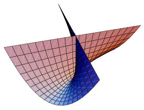
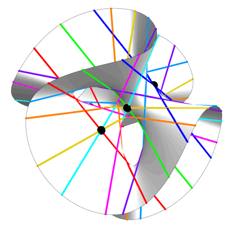

# Cubic Function

[TOC]

## Define

$$
\begin{align*}
f(x) &= \sum_{i=0}^{3} a_i x^i  \tag{Univariate} \\
f(\boldsymbol x) &= \sum\limits_{i_1=0}^{\dim} \sum\limits_{i_2=i_1}^{\dim} \sum\limits_{i_3=i_2}^{\dim}a_{i_1 i_2 i_3} \cdot x_{i_1} x_{i_2} x_{i_3}  \quad \text{where } x_0 = 1 \\
\end{align*}
$$

## Properties

### Zero Set of Cubic Function, Cubic Surface

$$
\left\{\boldsymbol x \ \Bigg|\ \sum\limits_{i_1=0}^{\dim} \sum\limits_{i_2=i_1}^{\dim} \sum\limits_{i_3=i_2}^{\dim}a_{i_1 i_2 i_3} \cdot x_{i_1} x_{i_2} x_{i_3}, \text{where } x_0 = 1 \right\}
$$

#### Solution of Univariate Cubic Equation  
For a Univariate Cubic Equation,
$$
x^3 + px + q = 0
$$

The solutions are,
$$
r = \sqrt[3]{-\frac{q}{2}+\sqrt{\frac{q^2}{4}+\frac{p^3}{27}}}+\sqrt[3]{-\frac{q}{2}-\sqrt{\frac{q^2}{4}+\frac{p^3}{27}}}
$$

#### Property

- There are exactly 27 straight lines on each smooth cubic algebraic surface in the complex field.

#### Fermat Cubic

$$
\left\{ x \ \Bigg|\ \sum_{i = 1}^{\dim} x_i^3 = 0 \right\}
$$

#### Whitney Umbrella

$$
x^2 z -a y^2 = 0
$$

$$
\left\{\begin{align*}
x &= uv\\
y&= u\\
z &= v^2
\end{align*}\right.
$$

#### Clebsch Diagonal Cubic

$$
x^3 + y^3 + z^3 + w^3 + (x + y + z + w)^3 = 0
$$

Clebsch diagonal cubic is a hyperplane cross-section in the complex projective space $\mathbb {P}^4$. It is the only smooth cubic surface with all 27 real lines in the real number field.

## Include

- [Elliptic_Curve](./Elliptic_Curve.md): 

## Parents

- [Polynomial_Function](./Polynomial_Function.md): is-a

