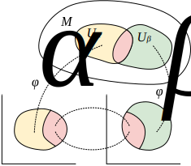

# Differential Manifold

[TOC]

## Define

Differential manifold $M$ of dimension $n$ is a [manifold](./Manifold.md) and equipped with a differentiable structure. Differentiable structure refers to there exists a collection of charts $\{(U_\alpha, \varphi_\alpha)\}$ such that $\bigcup_{\alpha}U_{\alpha}=M$, for all overlapping charts $(U_{\alpha},\varphi_{\alpha}), (U_{\beta},\varphi_{\beta})$ in the atlas with $U_{\alpha}\cap U_{\beta}\neq\varnothing$, then the transition maps $\varphi_{\beta}\circ\varphi_{\alpha}^{-1}:\varphi_{\alpha}(U_{\alpha}\cap U_{\beta})\to\varphi_{\beta}(U_{\alpha}\cap U_{\beta})$ are smooth (infinitely differentiable $C^\infty$) map. This collection of charts is called an smooth atlas.

## Properties

### Relationship between multiply differential manifolds

#### Continuity

$f: M \to M'$ is a $C^r$ mapping $\Leftrightarrow$ $\forall p \in M, \psi_\beta \circ f \circ \psi_\alpha^{-1}$ is $C^r$

- $\psi_\alpha: M \to \mathbb R^{n}$
- $\psi_\beta: M' \to \mathbb R^{n'}$
- $f = \psi_\beta \circ f \circ \psi_\alpha^{-1}$

#### Diffeomorphic

$M, M'$ is Diffeomorphic $\leftrightarrow \exist f: M \to M'$ is one to one, and $f, f^{-1}$ is $C^{\infty}$

### Relationship between differential manifolds and $\mathbb R^n$

#### Scalar Field: $M \to \mathbb R$

The function $f: M \to \mathbb R$ is intrinsically defined and unique in itself, requiring no dependence on the choice of coordinate system. When combine with a special coordinate system $(O, \psi)$, we obtain the coordinate representation of this function in the local coordinates — an n-variable function $f (x_1, \cdots, x_n)$ expressed through coordinate parameters. This coordinate-dependent representation undergoes corresponding variations depending on the chosen coordinate system.

#### Curve: $\mathbb R \to M$

$$
C: (I \in \mathbb R) \to M
$$

### Tangent Space

$$
T_pM = \left\{D:C^\infty (M) \to \mathbb R \;\Big|\; D \text{ is linear}, D(fg) = f(p) D(g) + g(p) D(f)  \right\}
$$

The tangent space $T_p M$ at a point $p$ on a differential manifold $M$ is a vector space that consists of all possible directional derivatives at $p$. Tangent space is a local linear approximation of a manifold.

- $C^{\infty}$  is the space of differential real-valued functions on manifold
- Leibniz rule: $D(fg) = f(p) D(g) + g(p) D(f)$

#### Tangent vector

$$
T(f) = \frac{\mathrm d (f \circ C)}{\mathrm d t} \Big|_{t_0}  \quad ,\forall f \in \mathcal F_M
$$

For a function $f$, Tangent vector $X_p \in T_p M$ of curve $C$ at $t_0$.

### Metric Tensor

$$
g_p = T_p M \times T_p M \to \mathbb R
$$

Metric [tensor](./Tensor.md) is a symmetric, non-degenerate, bilinear form that defines the inner product on the tangent space at each point of a manifold. For a differential manifold $M$, the metric tensor $g$ is a $(0, 2)$-tensor field that assigns to each point $p \in M$ a bilinear map.

- Symmetric: $g(u, v) = g(v, u), \forall u, v$ from tangent vectors.
- Non-degenerate: $\forall u, g(u, v) = 0 \rightarrow v = 0$

In local coordinates $(x_1, \cdots, x_n)$, the metric can be express as $g = g_{ij} \mathrm d x^i \otimes \mathrm d x^j$, where $g_{ij} = g_{ji}$ and $\det(g_ij) \neq 0$.

Therefore, by analogy with the inner product in Euclidean space, we can utilize the metric tensor to establish the following definition.

- Length of vector: $|v| = \sqrt{|g(v, v)|}$
- Orthogonal: $g(u, v) = 0$

Symbols:
- $T_p M$ is the tangent space at $p$.

#### Classification of Metric Tensor

- Positive definite / Riemannian matric tensor: $g(x, x) \ge 0$ with equality iff $x = 0$.
- Negative definite matric tensor:
- Lorentz metric: Diagonal element is $(-1, 1, 1, 1)$

### Affine Connection

#### Derivative operator

$$
\nabla: \mathcal F_M(k, l) \to \mathcal F_M(k, l + 1)
$$

For the set $\mathcal F_M$ represents the all $C^\infty \ (k, l)$-tensor field on the manifold $M$, Derivative operator

- $\nabla_a (a T + b S) = a \nabla_a T + b \nabla S$
- Leibnitz rule: $\nabla_a (TS) = T \nabla_a S + S \nabla_a T$
- 与缩并可交换顺序
- $v(f) = v^a \nabla_a f , \forall f \in \mathcal F_M, v \in \mathcal F_M (1, 0)$
- torsion-free: $\nabla_a \nabla_b f = \nabla_b \nabla_a f$

#### Christoffel Symbol

Christoffel symbols describe how basis vectors change along a manifold and are used to define the Levi-Civita connection (a metric-compatible, torsion-free connection).
$$
\var A^i = -\Gamma^i_{kl} A^k \mathrm{d} x^l
$$
**Christoffel Symbols of the First Kind**
$$
\Gamma_{kij} = \frac{1}{2} \left( \frac{\partial g_{il}}{\partial x^j} + \frac{\partial g_{jl}}{\partial x^i} - \frac{\partial g_{ij}}{\partial x^l} \right)
$$

**Christoffel Symbols of the Second Kind** 

$$
\Gamma^k_{ij} = \frac{1}{2} g^{kl} \left( \frac{\partial g_{il}}{\partial x^j} + \frac{\partial g_{jl}}{\partial x^i} - \frac{\partial g_{ij}}{\partial x^l} \right)
$$

Christoffel Symbols of the Second Kind is components of derivative operator (connection) in local coordinate system, obtained by raising the index of the first-kind symbols using the inverse metric.

- **基底向量场的协变导数**：在坐标基底 $\{\partial_i\}$ 下，联络作用于基底向量场的表达式为：$\nabla_{\partial_i} \partial_j = \Gamma^k_{ij} \partial_k$. 这表明 $\Gamma^k_{ij}$ 描述了基底向量 $\partial_j$ 沿 $\partial_i$ 方向的变化率。
- **协变导数的分量公式**：对任意向量场 $Y = Y^j \partial_j$，沿方向 $X = X^i \partial_i$ 的协变导数为 $(\nabla_X Y)^k = X^i \left( \partial_i Y^k + \Gamma^k_{ij} Y^j \right)$

### Geodesic

$$
\frac{d^2 x^k}{d\tau^2} + \Gamma^k_{ij} \frac{dx^i}{d\tau} \frac{dx^j}{d\tau} = 0
$$

- $\frac{d^2 x^k}{d\tau^2}$: 加速度的二阶导数项
- $\Gamma^k_{ij} \frac{dx^i}{d\tau} \frac{dx^j}{d\tau}$: Christoffel Symbol 的修正, 坐标系弯曲或非惯性效应的修正项

## Include

- [Euclidean_Space](./Euclidean_Space.md): 

## Parents

- [Manifold](./Manifold.md): 

