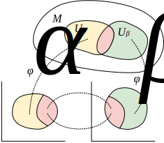

# Differential Manifold

[TOC]

## Define

Differential manifold $M$ of dimension $n$ is a [manifold](./Manifold.md) and equipped with a differentiable structure. Differentiable structure refers to there exists a collection of charts $\{(U_\alpha, \varphi_\alpha)\}$ such that $\bigcup_{\alpha}U_{\alpha}=M$, for all overlapping charts $(U_{\alpha},\varphi_{\alpha}), (U_{\beta},\varphi_{\beta})$ in the atlas with $U_{\alpha}\cap U_{\beta}\neq\varnothing$, then the transition maps $\varphi_{\beta}\circ\varphi_{\alpha}^{-1}:\varphi_{\alpha}(U_{\alpha}\cap U_{\beta})\to\varphi_{\beta}(U_{\alpha}\cap U_{\beta})$ are smooth (infinitely differentiable $C^\infty$) map. This collection of charts is called an smooth atlas.

## Properties

### Relationship between multiply differential manifolds

#### Continuity

$f: M \to M'$ is a $C^r$ mapping $\Leftrightarrow$ $\forall p \in M, \psi_\beta \circ f \circ \psi_\alpha^{-1}$ is $C^r$

- $\psi_\alpha: M \to \mathbb R^{n}$
- $\psi_\beta: M' \to \mathbb R^{n'}$
- $f = \psi_\beta \circ f \circ \psi_\alpha^{-1}$

#### Diffeomorphic

$M, M'$ is Diffeomorphic $\leftrightarrow \exist f: M \to M'$ is one to one, and $f, f^{-1}$ is $C^{\infty}$

### Relationship between differential manifolds and $\mathbb R^n$

#### Scalar Field: $M \to \mathbb R$

The function $f: M \to \mathbb R$ is intrinsically defined and unique in itself, requiring no dependence on the choice of coordinate system. When combine with a special coordinate system $(O, \psi)$, we obtain the coordinate representation of this function in the local coordinates — an n-variable function $f (x_1, \cdots, x_n)$ expressed through coordinate parameters. This coordinate-dependent representation undergoes corresponding variations depending on the chosen coordinate system.

#### Curve: $\mathbb R \to M$

$$
C: (I \in \mathbb R) \to M
$$

### Tangent Space

$$
T_pM = \left\{D:C^\infty (M) \to \mathbb R \;\Big|\; D \text{ is linear}, D(fg) = f(p) D(g) + g(p) D(f)  \right\}
$$

The tangent space $T_p M$ at a point $p$ on a differential manifold $M$ is a vector space that consists of all possible directional derivatives at $p$. Tangent space is a local linear approximation of a manifold.

- $C^{\infty}$  is the space of differential real-valued functions on manifold
- Leibniz rule: $D(fg) = f(p) D(g) + g(p) D(f)$

> Tangent Space is the linear space that best approximates the manifold near that point.

#### Tangent vector

$$
T(f) = \frac{\mathrm d (f \circ C)}{\mathrm d t} \Big|_{t_0}  \quad ,\forall f \in \mathcal F_M
$$

For a function $f$, Tangent vector $X_p \in T_p M$ of curve $C$ at $t_0$.

### Metric Tensor

$$
g_p = T_p M \times T_p M \to \mathbb R
$$

Metric [tensor](./Tensor.md) is a symmetric, non-degenerate, bilinear form that defines the inner product on the tangent space at each point of a manifold. For a differential manifold $M$, the metric tensor $g$ is a $(0, 2)$-tensor field that assigns to each point $p \in M$ a bilinear map.

- Symmetric: $g(u, v) = g(v, u), \forall u, v$ from tangent vectors.
- Non-degenerate: $\forall u, g(u, v) = 0 \rightarrow v = 0$

In local coordinates $(x_1, \cdots, x_n)$, the metric can be express as $g = g_{ij} \mathrm d x^i \otimes \mathrm d x^j$, where $g_{ij} = g_{ji}$ and $\det(g_ij) \neq 0$.

Therefore, by analogy with the inner product in Euclidean space, we can utilize the metric tensor to establish the following definition.

- Length of vector: $|v| = \sqrt{|g(v, v)|}$
- Orthogonal: $g(u, v) = 0$

Symbols:
- $T_p M$ is the tangent space at $p$.

#### Classification of Metric Tensor

- Positive definite / Riemannian matric tensor: $g(x, x) \ge 0$ with equality iff $x = 0$.
- Negative definite matric tensor:
- Lorentz metric: Diagonal element is $(-1, 1, 1, 1)$

### Affine Connection

#### Derivative Operator

$$
\nabla: \mathcal F_M(k, l) \to \mathcal F_M(k, l + 1)
$$

For the set $\mathcal F_M$ represents the all $C^\infty \ (k, l)$-tensor field on the manifold $M$, Derivative operator

- $\nabla_a (a T + b S) = a \nabla_a T + b \nabla S$
- Leibnitz rule: $\nabla_a (TS) = T \nabla_a S + S \nabla_a T$
- Swappable order with contraction.
- $v(f) = v^a \nabla_a f , \forall f \in \mathcal F_M, v \in \mathcal F_M (1, 0)$
- torsion-free: $\nabla_a \nabla_b f = \nabla_b \nabla_a f$

Example:

- $\nabla_a f = T_a$, the gradient field is a dual vector field.

#### Christoffel Symbol

Christoffel symbols describe how basis vectors change along a manifold and are used to define the Levi-Civita connection (a metric-compatible, torsion-free connection).
$$
\var A^i = -\Gamma^i_{kl} A^k \mathrm{d} x^l
$$
**Christoffel Symbols of the First Kind**
$$
\Gamma_{kij} = \frac{1}{2} \left( \frac{\partial g_{il}}{\partial x^j} + \frac{\partial g_{jl}}{\partial x^i} - \frac{\partial g_{ij}}{\partial x^l} \right)
$$

**Christoffel Symbols of the Second Kind** 

$$
\Gamma^k_{ij} = \frac{1}{2} g^{kl} \left( \frac{\partial g_{il}}{\partial x^j} + \frac{\partial g_{jl}}{\partial x^i} - \frac{\partial g_{ij}}{\partial x^l} \right)
$$

$$
\nabla_\mu V = (\part_\mu V^\nu + \Gamma_{\mu\lambda}^\nu V^\lambda) \part_\nu\\
\nabla_\mu \part_\nu = \Gamma_{\mu\nu}^ \lambda\part_ \lambda
$$

Christoffel Symbols of the Second Kind is components of derivative operator (connection) in local coordinate system, obtained by raising the index of the first-kind symbols using the inverse metric.

- **Covariant Derivative of Basis Vector Fields**: Under the coordinate basis $\{\partial_i\}$, the expression for the interaction acting on the basis vector field is: $\nabla_{\partial_i} \partial_j = \Gamma^k_{ij} \partial_k$. This shows that $\Gamma^k_{ij}$ describes the rate of change of the basis vector $\partial_j$ along the direction $\partial_i$.
- **Component Formula of Covariant Derivative**: For any vector field $Y = Y^j \partial_j$, the covariant derivative along the direction $X = X^i \partial_i$ is $(\nabla_X Y)^k = X^i \left( \partial_i Y^k + \Gamma^k_{ij} Y^j \right)$

### Geodesic

A geodesic is the curve that locally extremizes distance on a manifold.
$$
\frac{d^2 x^k}{d\tau^2} + \Gamma^k_{ij} \frac{dx^i}{d\tau} \frac{dx^j}{d\tau} = 0
$$

- $\frac{d^2 x^k}{d\tau^2}$: Second derivative term of acceleration
- $\Gamma^k_{ij} \frac{dx^i}{d\tau} \frac{dx^j}{d\tau}$: Christoffel symbol correction, correction term for coordinate system curvature or non-inertial effects

> Proof.
>
> **Target**: In coordinates $x^\mu(\lambda)$, the metric is $ds^2 = g_{\mu\nu}(x)\, dx^\mu dx^\nu.$ We want the equation satisfied by a curve $x^\mu(\lambda)$ that makes the length stationary.
>
> **1. Length functional**
>
> For a curve parameterized by $\lambda$, the arc length is
> $$
> S[x] = \int ds = \int \sqrt{g_{\mu\nu}(x)\,\frac{dx^\mu}{d\lambda}\frac{dx^\nu}{d\lambda}}\, d\lambda.
> $$
>
> Let $\dot{x}^\mu = \frac{dx^\mu}{d\lambda}.$ Then the Lagrangian is
> $$
> L = \sqrt{g_{\mu\nu}(x)\,\dot{x}^\mu \dot{x}^\nu }.
> $$
> So the variational problem is
> $$
> \delta \int L\, d\lambda = 0.
> $$
> **2. Euler–Lagrange equation**
>
> The Euler–Lagrange equations are
> $$
> \frac{d}{d\lambda}\left(\frac{\partial L}{\partial \dot{x}^\rho}\right) - \frac{\partial L}{\partial x^\rho} = 0.
> $$
> Derivative with respect to velocity, Since $L = \big(g_{\mu\nu}\dot{x}^\mu \dot{x}^\nu\big)^{1/2},$ we get
> $$
> \frac{\partial L}{\partial \dot{x}^\rho} = \frac{1}{2L}\cdot 2g_{\rho\nu}\dot{x}^\nu = \frac{g_{\rho\nu}\dot{x}^\nu}{L}.
> $$
> Derivative with respect to position. Because the metric depends on $x$,
> $$
> \frac{\partial L}{\partial x^\rho} = \frac{1}{2L}\,\partial_\rho g_{\mu\nu}\,\dot{x}^\mu \dot{x}^\nu,
> $$
> where $\partial_\rho g_{\mu\nu} = \frac{\partial g_{\mu\nu}}{\partial x^\rho}.$ Substitute into Euler–Lagrange:
> $$
> \frac{d}{d\lambda}\left(\frac{g_{\rho\nu}\dot{x}^\nu}{L}\right) - \frac{1}{2L}\partial_\rho g_{\mu\nu}\dot{x}^\mu \dot{x}^\nu = 0.
> $$
> This is already a correct geodesic equation, but it is not yet in the standard form.
>
> **3. Use an affine parameter**
>
> The square-root Lagrangian is inconvenient. A standard simplification is to choose an **affine parameter** $s$, often proper length or proper time, so that along the curve
> $$
> g_{\mu\nu}\frac{dx^\mu}{ds}\frac{dx^\nu}{ds} = \text{constant}.
> $$
> Then we may use the equivalent Lagrangian
> $$
> L' = \frac12 g_{\mu\nu}(x)\,\dot{x}^\mu \dot{x}^\nu,
> $$
> where now dot means $d/ds$. This gives the same geodesics up to reparameterization. The Euler–Lagrange equation becomes
> $$
> \frac{d}{ds}\left(\frac{\partial L'}{\partial \dot{x}^\rho}\right) - \frac{\partial L'}{\partial x^\rho} = 0.
> $$
> Compute:
> $$
> \begin{aligned}
> \frac{\partial L'}{\partial \dot{x}^\rho} &= \frac12 \cdot 2 g_{\rho\nu}\dot{x}^\nu = g_{\rho\nu}\dot{x}^\nu \\
> \frac{\partial L'}{\partial x^\rho} &= \frac12 \partial_\rho g_{\mu\nu}\dot{x}^\mu \dot{x}^\nu
> \end{aligned}
> $$
>
> $$
> \Rightarrow \frac{d}{ds}(g_{\rho\nu}\dot{x}^\nu) - \frac12 \partial_\rho g_{\mu\nu}\dot{x}^\mu \dot{x}^\nu = 0.
> $$
>
> Expand the total derivative:
>
> $$
> \begin{aligned}
> \partial_\sigma g_{\rho\nu}\,\dot{x}^\sigma \dot{x}^\nu + g_{\rho\nu}\ddot{x}^\nu - \frac12 \partial_\rho g_{\mu\nu}\dot{x}^\mu \dot{x}^\nu &= 0.\\
> \Rightarrow g_{\rho\nu}\ddot{x}^\nu + \partial_\sigma g_{\rho\nu}\,\dot{x}^\sigma \dot{x}^\nu - \frac12 \partial_\rho g_{\mu\nu}\dot{x}^\mu \dot{x}^\nu &= 0.
> \end{aligned}
> $$
>
> **4. Isolate** $\ddot{x}^\mu$
>
> Multiply by the inverse metric $g^{\lambda\rho}$:
> $$
> \ddot{x}^\lambda + g^{\lambda\rho}\partial_\sigma g_{\rho\nu}\,\dot{x}^\sigma \dot{x}^\nu - \frac12 g^{\lambda\rho}\partial_\rho g_{\mu\nu}\dot{x}^\mu \dot{x}^\nu = 0.
> $$
> Now symmetrize the second term in $\mu,\nu$. Since $\dot{x}^\mu \dot{x}^\nu$ is symmetric,
> $$
> g^{\lambda\rho}\partial_\sigma g_{\rho\nu}\,\dot{x}^\sigma \dot{x}^\nu = \frac12 g^{\lambda\rho}\left(\partial_\mu g_{\rho\nu} + \partial_\nu g_{\rho\mu}\right)\dot{x}^\mu \dot{x}^\nu.\\
> \ddot{x}^\lambda + \frac12 g^{\lambda\rho}\left(\partial_\mu g_{\rho\nu} + \partial_\nu g_{\rho\mu} - \partial_\rho g_{\mu\nu}\right)\dot{x}^\mu \dot{x}^\nu = 0.
> $$
> Define the **Christoffel symbols**:
> $$
> \Gamma^\lambda_{\mu\nu} = \frac12 g^{\lambda\rho}\left(\partial_\mu g_{\rho\nu} + \partial_\nu g_{\rho\mu} - \partial_\rho g_{\mu\nu}\right).
> $$
> Then the geodesic equation takes its standard form, This is the **geodesic equation**.
> $$
> \frac{d^2 x^\lambda}{ds^2} + \Gamma^\lambda_{\mu\nu}\frac{dx^\mu}{ds}\frac{dx^\nu}{ds} = 0.
> $$
> **5. Interpretation**
>
> This equation says that the curve has zero covariant acceleration. In words, the tangent vector is parallel transported along the curve itself. In flat Cartesian coordinates, all Christoffel symbols vanish, so the equation reduces to $\frac{d^2 x^\lambda}{ds^2}=0,$ whose solutions are straight lines.
> $$
> \frac{D}{ds}\left(\frac{dx^\lambda}{ds}\right)=0.
> $$
> **6. Non-affine parameter form**
>
> If the curve is parameterized by a general parameter $\lambda$ rather than an affine one, the equation becomes
> $$
> \frac{d^2 x^\lambda}{d\lambda^2} + \Gamma^\lambda_{\mu\nu}\frac{dx^\mu}{d\lambda}\frac{dx^\nu}{d\lambda} = f(\lambda)\frac{dx^\lambda}{d\lambda},
> $$
> for some function $f(\lambda)$. The extra term disappears when $\lambda$ is affine.
>
> **Final result**
>
> The geodesics of a metric $g_{\mu\nu}$ satisfy
> $$
> \frac{d^2 x^\lambda}{ds^2} + \Gamma^\lambda_{\mu\nu}\frac{dx^\mu}{ds}\frac{dx^\nu}{ds} = 0,
> $$
> with
> $$
> \Gamma^\lambda_{\mu\nu} = \frac12 g^{\lambda\rho}\left(\partial_\mu g_{\rho\nu} + \partial_\nu g_{\rho\mu} - \partial_\rho g_{\mu\nu}\right).
> $$

## Include

- [Euclidean_Space](./Euclidean_Space.md): subtype_of

## Parents

- [Manifold](./Manifold.md): subtype_of

