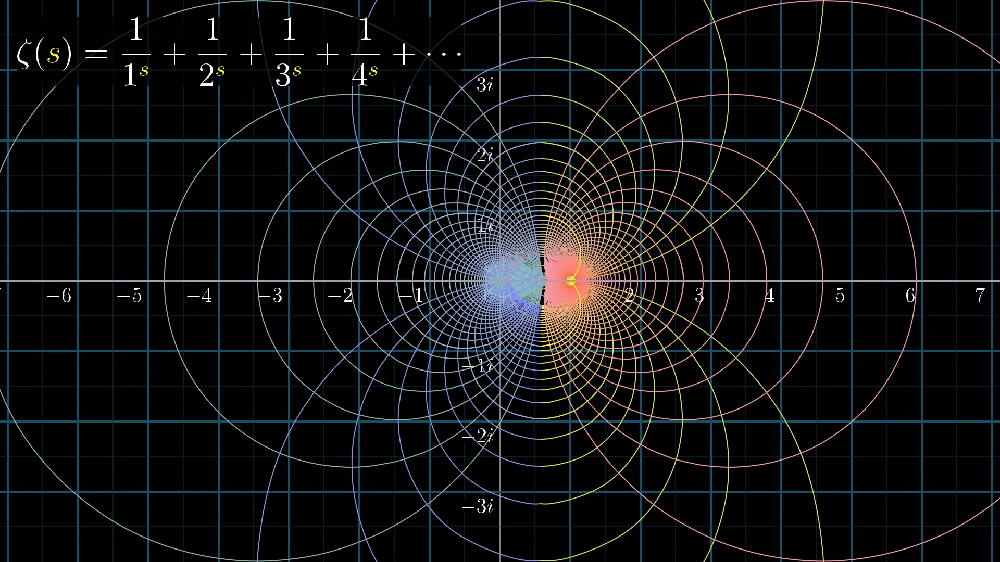

# Riemann Zeta Function

[TOC]

## Define

$$
\zeta(s)=\sum_{n=1}^{\infty} \frac{1}{n^{s}}=\frac{1}{\Gamma(s)} \int_{0}^{\infty} \frac{x^{s-1}}{e^{x}-1} \mathrm{~d} x
$$

Riemann zeta function for $s$ where $\Re(s) > 1$ is as described above ([Complex function](./Complex_Value_Function.md)). (This series is absolutely convergent in the above region.) The Riemann function is analytically extended to the complex plane, anywhere except for point $s=1$, achieved through a series of functional relationships and integral representations. At $s = 1$, the Riemannian function has a simple pole.

## Properties

- the relationship with primes
  $$
  \zeta(s) = \prod_{p \text{ is prime}} \frac{1}{1 - p^{-s}}
  $$

- Riemann Hypothesis: Riemann zeta function has its zeros only at the negative even integers and complex numbers with real part $\frac{1}{2}$.

## Include

## Parents

- [Complex_Value_Function](./Complex_Value_Function.md): 

