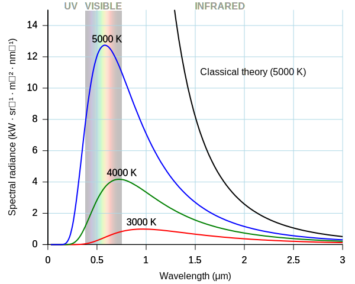

# Blackbody Radiation

$$
B_\nu(T) = \frac{2hv^3}{c^2}\frac{1}{e^{\frac{h \nu}{kT}} - 1}
$$

- $B_\nu(T)$: the spectral radiance at the template $T$.

> ***Proof:***
>
> 1. Total radiation density: $u(\nu, T) = N(\nu) \langle E\rangle$
> 2. Radiative exitance: $B_\nu(T) = \frac{c}{4 \pi} u(\nu, T)$
> 3. Energy quantization of harmonic oscillators: $E_n = n \epsilon =n h \nu, n\in \mathbb Z$
> 4. Probability of a harmonic oscillator being at energy level $E_n$: $N(E_n)  \propto e^{-\frac{E_n}{k_B T}}$
> 5. Density of states：$N(\nu) = \frac{8 \pi \nu^2}{c^3}$
>
> $$
> \begin{align*}
> \langle E\rangle &= \frac{\sum\limits_{n \in \mathbb Z} E_n N(E_n)}{\sum\limits_{n \in \mathbb Z} N(E_n)}\\
> &= \frac{ \sum\limits_{n \in \mathbb Z} n h \nu e^{-\frac{nh\nu}{k_B T}} }{\sum\limits_{n \in \mathbb Z} e^{-\frac{nh\nu}{k_B T}}} \\
> &= h \nu \frac{ \sum\limits_{n \in \mathbb Z} n x^n}{\sum\limits_{n \in \mathbb Z} x^n}  \tag{$x = e^{-\frac{h\nu}{k_B T}}$}  \\
> &= h \nu \frac{\frac{x}{(1-x)^2}}{\frac{1}{1-x}} \tag{Series formula}\\
> &= h \nu \frac{x}{1-x} \\
> &= h \nu \frac{e^{-\frac{h\nu}{k_B T}}}{1-e^{-\frac{h\nu}{k_B T}}} \\
> &= h \nu \frac{1}{e^{\frac{h\nu}{k_B T}}-1} 
> \end{align*}
> $$
>
>
> $$
> \begin{align*}
> B_\nu(T) &= \frac{c}{4 \pi} \frac{8 \pi \nu^2}{c^3} \langle E\rangle \\
> &= \frac{2\nu^2}{c^2}  \langle E\rangle \\
> &= \frac{2h \nu^3}{c^2} \frac{1}{e^{\frac{h\nu}{k_B T}}-1} 
> \end{align*}
> $$

