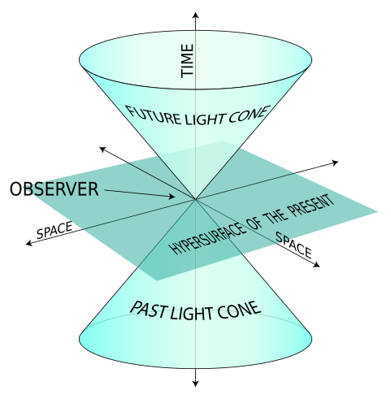

# Mechanics of flat spacetime

[TOC]

## Flat relativity spacetime

### Relativity principle

**The relativity principle**: All natural laws are the same in all inertial reference frames.

**The propagation speed of interactions**: The maximum propagation speed of interaction is the same in all inertial reference frames (as can be derived from the principle of relativity). It can be proven that this speed is the speed of light in a vacuum.
$$
c = 2.998 × 10^8 m/s
$$

### Minkowski Space-time

$$
(t, x, y, z)
$$

Minkowski spacetime is a four-dimensional manifold that combines three-dimensional Euclidean space and time. 

#### Space-Time Interval: Minkowski Metric

the space-time interval between two events in Minkowski space is given by the equation:
$$
\begin{align*}
  s_{12} &= (c^2 (t_2-t_1)^2 - (x_2-x_1)^2 - (y_2-y_1)^2 - (z_2-z_1)^2)^{\frac{1}{2}}  \\
  \mathrm{d} s &= (c^2 \mathrm d t^2 - \mathrm d x^2 - \mathrm d y^2 - \mathrm d z^2)^{\frac{1}{2}}
\end{align*}
$$

### Lorentz Transformation

$$
\begin{align*}
    \left(\begin{matrix} ct' \\ x' \\ y' \\ z' \end{matrix}\right) &= \left(\begin{matrix} 
    \frac{1}{\sqrt{1-(\frac{V}{c})^2}} & \frac{-\frac{V}{c}}{\sqrt{1-( \frac{V}{c} )^2}}  \\
    \frac{-\frac{V}{c}}{\sqrt{1-( \frac{V}{c} )^2}} & \frac{1}{\sqrt{1-( \frac{V}{c} )^2}} \\
    & & 1\\ & & & 1 \end{matrix}\right)   \left(\begin{matrix} ct \\ x \\ y \\ z \end{matrix}\right)
  \end{align*}
$$
Consider two inertial reference frames $K$ and $K'$, where $K'$ moves relative to $K$ along the $x$-axis with velocity $V$.

> ***Proof: Lorentz Transformation***
>
> Consider two inertial reference frames $S$ and $S'$. Let their spacetime coordinates of an event be $x^\mu = (ct, x, y, z)$ with Minkowski metric $\eta$. We choose the standard configuration: the spatial axes of $S$ and $S'$ are parallel, their origins coincide at $t=t'=0$, and $S'$ moves with constant velocity $V$ in the $+x$ direction relative to $S$.
>
> Our goal is to determine the coordinate transformation
> $$
> x'^\mu = F(x^\nu)
> $$
>
> 1. *Spacetime Homogeneity and Linearity*
>
> The principle of relativity states that the laws of physics have the same form in every inertial frame. Spacetime homogeneity means that there are no privileged positions in space or privileged moments in time. Therefore, the transformation between inertial coordinate systems must be affine:
> $$
> x'^\mu=\Lambda^\mu{}_\nu x^\nu+a^\mu
> $$
> If the origins of the two coordinate systems are chosen to coincide at $t = t' = 0$, then the transformation is linear.
> $$
> x'^\mu=\Lambda^\mu{}_\nu x^\nu
> $$
> 2. *Spatial isotropy.*
>
> There are no special spatial directions. Choose the Relative Motion Along the $x$-Axis. There is then no reason for the perpendicular coordinates $y$ and $z$ to mix with $t$ or $x$. (Interval invariance can proof $k = 1$)
> $$
> \boldsymbol x' = \begin{pmatrix}a & b\\ c & d \\ & & kI_2 \end{pmatrix}\boldsymbol x \\
> \boldsymbol A_{ct,x} = \begin{pmatrix}a & b\\ c & d  \end{pmatrix}
> $$
>
> 3. *Invariance of the Spacetime Interval*
>
> The principle of constant speed of light preserves the Minkowski spacetime interval.
> $$
> \begin{align*}
> Δs^2 &= Δs'^2
> \end{align*}
> $$
> We get $\boldsymbol \eta = \boldsymbol A^T \boldsymbol \eta \boldsymbol A$.
> $$
> \begin{align*}
> \boldsymbol x^T \boldsymbol \eta \boldsymbol x &= \boldsymbol x'^T \boldsymbol \eta \boldsymbol x'  \tag{simplified form}  \\
> \boldsymbol x^T \boldsymbol \eta \boldsymbol x &= (\boldsymbol A \boldsymbol x)^T \boldsymbol \eta (\boldsymbol A \boldsymbol x)  \tag{substitution}  \\
> \boldsymbol x^T \boldsymbol \eta \boldsymbol x &= \boldsymbol x^T \boldsymbol A^T \boldsymbol\eta \boldsymbol A \boldsymbol x  \tag{transposition}  \\
> \boldsymbol η &= \boldsymbol A^T \boldsymbol \eta \boldsymbol A  \tag{matrix calculation}
> \end{align*}
> $$
> Meanwhile, $\det \boldsymbol  A = 1$.
>
> 4. *Combine 2 and 3*
>
> $$
> \begin{pmatrix}a&c\\b&d\end{pmatrix} \begin{pmatrix}1&0\\0&-1\end{pmatrix} \begin{pmatrix}a&b\\c&d\end{pmatrix} = \begin{pmatrix}1&0\\0&-1\end{pmatrix}
> $$
>
> We get,
> $$
> \left\{
> \begin{aligned}
> a^2-c^2 &= 1,\\
> b^2-d^2 &= -1,\\
> ab-cd   &= 0.
> \end{aligned}
> \right.
> $$
>
> 5. *hyperbolic rotation is the solution.*
>
> Exclude invalid solutions such as spatial inversion and time reversal, the hyperbolic function $\cosh ^ 2 x - \sinh ^ 2 x=1$ is the general solution that satisfies the system of equations, which is the rotation transformation matrix of the $t$-$x$ plane,
> $$
> \boldsymbol A_{t,x} = \begin{pmatrix} \cosh μ & -\sinh μ \\ -\sinh μ & \cosh μ \end{pmatrix}
> $$
> 6. *Determine $\mu$ using relative velocity.*
>
> Because $S$ moves at velocity $V$ in the $+x$ direction relative to $S$. Then, we get
> $$
> \left\{
> \begin{aligned}
> x' &= 0,\\
> x &= Vt.
> \end{aligned}
> \right.
> $$
> we get
> $$
> \begin{pmatrix} c t' \\ 0 \end{pmatrix}= \begin{pmatrix} \cosh μ & -\sinh μ \\ -\sinh μ & \cosh μ \end{pmatrix} \begin{pmatrix} c t \\ V t \end{pmatrix}
> $$
>
> $$
> \tanh \mu = \frac{V}{c}
> $$
>
> we set
> $$
> \left\{
> \begin{aligned}
> \beta &= \frac{V}{c},\\
> \gamma &= \frac{1}{\sqrt{1-\beta^2}}.
> \end{aligned}
> \right.
> $$
>
> Then,
> $$
> \left\{
> \begin{aligned}
> \tanh \mu &=\beta,\\
> \cosh \mu &= \gamma,\\
> \sinh \mu &=\gamma \beta.\\
> \end{aligned}
> \right.
> $$
> Ultimately, we obtain,
>
> $$
> \boldsymbol A = \begin{pmatrix} \gamma & - \gamma \beta\\ - \gamma \beta & \gamma \\ && 1 \\ &&& 1\end{pmatrix}
> $$

#### Transform of speed
$$
\begin{align*}
v_x &= \frac{v'_x + V}{1 + \frac{v'_x V}{c^2}}\\
v_y &= \frac{v'_y \sqrt{1 - \frac{V^2}{c^2}}}{1 + \frac{v'_x V}{c^2}}\\
v_z &= \frac{v'_z \sqrt{1 - \frac{V^2}{c^2}}}{1 + \frac{v'_x V}{c^2}}
\end{align*}
$$

## Action

### Action of flat relativity spacetime

$$
S = \int L \, d\tau\\
d\tau = \sqrt{1 - \frac{v^2}{c^2}}\mathrm{d}t
$$

